# وثيقة تدفقات المستخدم (User Flows)
## نظام Wow Shopping — الإصدار 1.0
### المجموعة الأولى: التدفقات المتداخلة بين الإدارات (Cross-Cutting Flows)

> **المرجع الأساسي:** خريطة حالات الاستخدام (Baseline 1.0) + وثيقة مواصفات حالات الاستخدام (Use Case Specifications).
> **نطاق هذه الوثيقة:** الـ 15 تدفقًا التي تربط أكثر من إدارة معًا (UC-X-01 إلى UC-X-15 في الخريطة المعتمدة)، لأنها الأكثر تعقيدًا واحتكاكًا بالعميل مباشرة، وتُبنى عليها لاحقًا خريطة التنقل (Navigation Map).
>
> **القالب المعتمد لكل تدفق:** معلومات التدفق ← المسار الرئيسي ← الفروع والاستثناءات ← المخطط البصري المختصر ← جدول الشاشات.
>
> **رمز حالة الشاشة في الجداول:** 🆕 جديدة (تظهر لأول مرة في هذه الوثيقة) | ♻️ مستخدمة سابقًا (ظهرت في تدفق آخر ضمن هذه الوثيقة).

---

## UF-01: إتمام الطلب (Checkout)

### 1) معلومات التدفق
| البيان | القيمة |
|---|---|
| **رقم التدفق** | UF-01 |
| **اسم التدفق** | إتمام الطلب (Checkout) |
| **الهدف** | تحويل عناصر سلة التسوق إلى طلب فعلي مؤكَّد، مع اختيار العنوان ووسيلة الشحن والدفع |
| **الممثلون المشاركون** | العميل المسجل (ACT-21)، النظام |
| **حالات الاستخدام المرتبطة** | UC-CART-02, UC-ORD-01, UC-ADDR-07, UC-PM-13, UC-SHP-07, UC-PUP-07/08, UC-VAR-11, UC-ITEM-01/02 |

### 2) المسار الرئيسي
1. يفتح العميل صفحة "سلة التسوق" ويراجع العناصر والإجمالي.
2. يضغط العميل على زر "إتمام الطلب".
3. يعرض النظام خطوة "عنوان الشحن": يختار العميل عنوانًا محفوظًا أو يُضيف عنوانًا جديدًا.
4. يعرض النظام خطوة "طريقة التسليم": يختار العميل بين التوصيل المنزلي أو الاستلام من مكتب (إن كانت المنطقة تدعم ذلك).
5. يحسب النظام تكلفة الشحن ووقت التوصيل تلقائيًا بناءً على المنطقة المختارة، ويعرضهما للعميل.
6. يعرض النظام خطوة "وسيلة الدفع": قائمة الوسائل المؤهلة فعليًا لقيمة الطلب الحالي.
7. يختار العميل وسيلة الدفع.
8. يعرض النظام "ملخص الطلب النهائي" (العناصر، الشحن، الإجمالي الكلي).
9. يضغط العميل على "تأكيد الطلب".
10. يتحقق النظام من توفر كل عنصر للمرة الأخيرة، وينشئ الطلب برقم فريد مع نسخة Snapshot كاملة من كل البيانات.
11. يُفرَّغ النظام السلة، ويُوجَّه العميل لصفحة "تم استلام طلبك" مع رقم الطلب.
12. يُرسل النظام إشعار تأكيد للعميل.

### 3) الفروع والاستثناءات
| الفرع | نقطة التفرع | الوصف | العودة/الإنهاء |
|---|---|---|---|
| A1 | الخطوة 3 | لا يوجد عنوان محفوظ | يُفتح نموذج "إضافة عنوان جديد" مباشرة ضمن نفس الخطوة، ثم يعود المسار للخطوة 4 |
| A2 | الخطوة 4 | المنطقة المختارة لا تدعم الاستلام من مكتب | يُخفى هذا الخيار تلقائيًا من القائمة |
| A3 | الخطوة 5 | لا توجد قاعدة تسعير شحن صالحة للمنطقة | تُعرض رسالة "الشحن غير متاح لهذه المنطقة حاليًا"، ويُمنع العميل من المتابعة حتى يغيّر العنوان |
| A4 | الخطوة 6 | لا توجد وسيلة دفع مؤهلة لقيمة الطلب | تُعرض رسالة توضيحية، ويُمنع العميل من المتابعة حتى تعديل السلة |
| A5 | الخطوة 10 | عنصر أصبح غير متوفر بين الإضافة والتأكيد | يُمنع إكمال الطلب، وتُعرض للعميل العناصر المتأثرة مع خيار إزالتها أو تعديل الكمية، ثم العودة للخطوة 8 |
| A6 | أي خطوة | العميل يضغط "رجوع" | يعود لصفحة السلة دون فقدان أي بيانات مُدخلة |

### 4) المخطط البصري المختصر

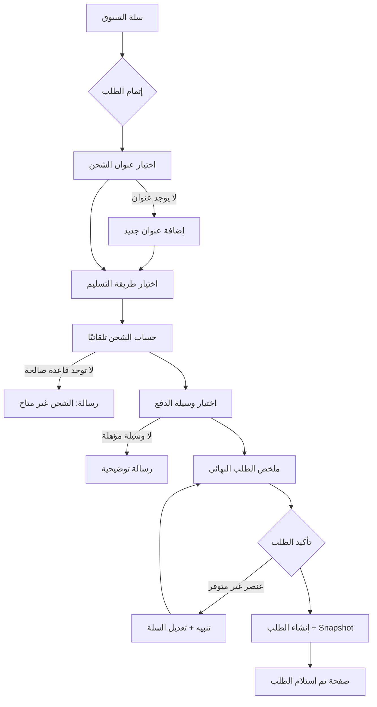

### 5) جدول الشاشات
| الشاشة | الوظيفة | الحالة |
|---|---|---|
| سلة التسوق | عرض العناصر والإجمالي، بدء الإتمام | 🆕 |
| معالج إتمام الطلب — خطوة العنوان | اختيار/إضافة عنوان شحن | 🆕 |
| نموذج إضافة عنوان جديد | إدخال عنوان جديد سريعًا | 🆕 |
| معالج إتمام الطلب — خطوة التسليم | اختيار توصيل منزلي/استلام مكتب | 🆕 |
| معالج إتمام الطلب — خطوة الدفع | اختيار وسيلة الدفع | 🆕 |
| ملخص الطلب النهائي | مراجعة شاملة قبل التأكيد | 🆕 |
| صفحة تأكيد الطلب | عرض رقم الطلب والتفاصيل بعد النجاح | 🆕 |

---

## UF-02: رفع وإرسال إثبات الدفع

### 1) معلومات التدفق
| البيان | القيمة |
|---|---|
| **رقم التدفق** | UF-02 |
| **اسم التدفق** | رفع وإرسال إثبات الدفع |
| **الهدف** | تمكين العميل من إثبات تحويله المالي اليدوي (بنكي/محفظة) لطلب بانتظار الدفع |
| **الممثلون المشاركون** | العميل المسجل (ACT-21)، النظام |
| **حالات الاستخدام المرتبطة** | UC-MEDIA-09, UC-TXN-01, UC-TXN-02, UC-PST-07 |

### 2) المسار الرئيسي
1. يفتح العميل صفحة "تفاصيل الطلب" لطلب بحالة "بانتظار الدفع".
2. يضغط العميل على "رفع إثبات الدفع".
3. يعرض النظام نموذج الإثبات: رقم الطلب (معبَّأ تلقائيًا)، وسيلة الدفع المختارة، حقل رقم العملية، منطقة رفع صورة.
4. يرفع العميل صورة الإثبات ويُدخل رقم العملية.
5. يضغط العميل "إرسال".
6. يتحقق النظام من صحة الملف (نوع/حجم).
7. يحفظ النظام الصورة كوسيط مرتبط بمعاملة الدفع.
8. يُحوّل النظام حالة دفع الطلب تلقائيًا إلى "قيد المراجعة المالية".
9. يعرض النظام رسالة نجاح "تم استلام إثباتك، سنراجعه قريبًا".
10. يُرسل النظام إشعارًا للمحقق المالي بوجود مراجعة جديدة.

### 3) الفروع والاستثناءات
| الفرع | نقطة التفرع | الوصف | العودة/الإنهاء |
|---|---|---|---|
| A1 | الخطوة 6 | الملف يتجاوز الحجم/الامتداد المسموح | تُعرض رسالة خطأ، يبقى العميل في نفس النموذج لإعادة الرفع |
| A2 | الخطوة 2 | الطلب مدفوع بالفعل | يُمنع العميل من الوصول لهذا الإجراء أصلاً (الزر لا يظهر) |
| A3 | الخطوة 4 | عدم إدخال رقم العملية (إن كان إلزاميًا) | يمنع النظام الإرسال ويُبرز الحقل الناقص |

### 4) المخطط البصري المختصر

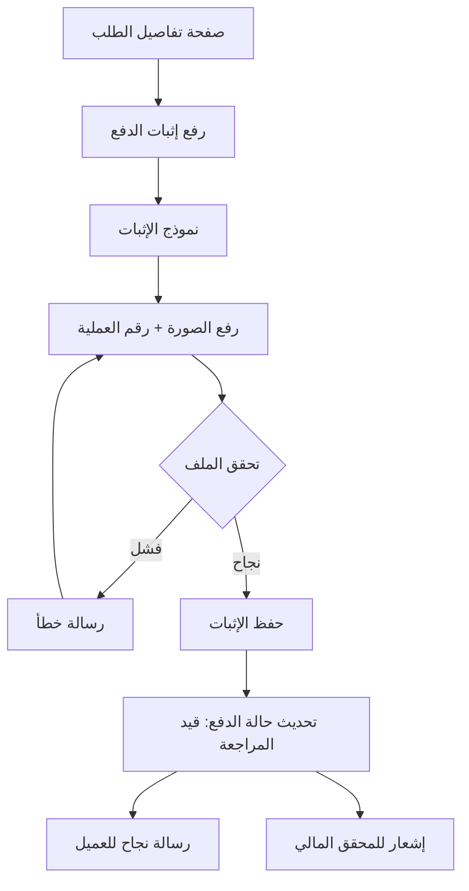

### 5) جدول الشاشات
| الشاشة | الوظيفة | الحالة |
|---|---|---|
| صفحة تفاصيل الطلب | نقطة البدء وعرض حالة الطلب | ♻️ (تُبنى بالكامل في UF-01 وتُستخدم عبر أغلب التدفقات) |
| نموذج رفع إثبات الدفع | رفع الصورة وبيانات العملية | 🆕 |
| رسالة نجاح الإرسال | تأكيد استلام الإثبات | 🆕 |

---

## UF-03: مراجعة واعتماد/رفض إثبات الدفع

### 1) معلومات التدفق
| البيان | القيمة |
|---|---|
| **رقم التدفق** | UF-03 |
| **اسم التدفق** | مراجعة واعتماد/رفض إثبات الدفع |
| **الهدف** | تمكين المحقق المالي من فحص إثبات الدفع واتخاذ قرار يؤثر مباشرة على حالة الطلب |
| **الممثلون المشاركون** | المحقق المالي (ACT-07)، النظام |
| **حالات الاستخدام المرتبطة** | UC-TXN-03, UC-MEDIA-10, UC-PST-04, UC-LOG-01 |

### 2) المسار الرئيسي
1. يفتح المحقق المالي شاشة "لوحة التحكم" ويدخل قسم "معاملات بانتظار المراجعة".
2. يعرض النظام قائمة المعاملات المعلَّقة.
3. يضغط المحقق على معاملة محددة.
4. يعرض النظام تفاصيل المعاملة: الطلب المرتبط، القيمة، الوسيلة، صورة الإثبات (بجودة أصلية قابلة للتكبير).
5. يفحص المحقق الصورة ورقم العملية ويقارنها بقيمة الطلب.
6. يختار المحقق "اعتماد" أو "رفض" أو "إعادة للمراجعة".
7. عند الاعتماد: يُضيف ملاحظة اختيارية، يضغط "تأكيد الاعتماد".
8. يُحدّث النظام حالة المعاملة إلى "معتمدة" وحالة دفع الطلب تلقائيًا.
9. يُسجّل النظام العملية في سجل النشاط.
10. يعرض النظام رسالة نجاح، ويعود المحقق لقائمة المراجعة.

### 3) الفروع والاستثناءات
| الفرع | نقطة التفرع | الوصف | العودة/الإنهاء |
|---|---|---|---|
| A1 | الخطوة 6 | المحقق يختار "رفض" | يُطلَب سبب الرفض إلزاميًا، تُحدَّث حالة المعاملة إلى "مرفوضة" مع حفظ السبب، إشعار اختياري للعميل، انتهاء التدفق |
| A2 | الخطوة 6 | المحقق يختار "إعادة للمراجعة" | تبقى المعاملة معلَّقة مع ملاحظة توضح ما هو مطلوب من العميل، انتهاء التدفق |
| A3 | الخطوة 5 | قيمة الإثبات لا تطابق قيمة الطلب | يُرفَض مباشرة (يتفرع لـ A1) مع سبب "المبلغ غير مطابق" |

### 4) المخطط البصري المختصر

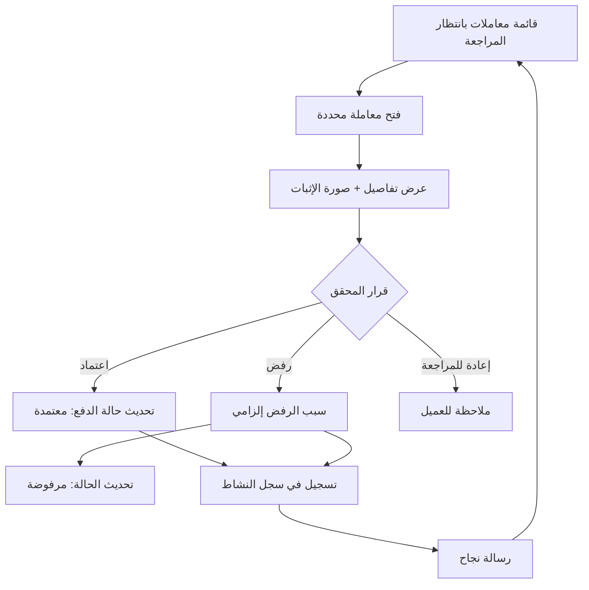

### 5) جدول الشاشات
| الشاشة | الوظيفة | الحالة |
|---|---|---|
| قائمة معاملات بانتظار المراجعة | عرض المعاملات المعلَّقة | 🆕 |
| صفحة تفاصيل المعاملة | فحص الإثبات واتخاذ القرار | 🆕 |
| عارض الصورة المكبَّر (Lightbox) | فحص صورة الإثبات بجودة أصلية | 🆕 |

---

## UF-04: تأكيد الدفع وتحديث الطلب تلقائيًا

### 1) معلومات التدفق
| البيان | القيمة |
|---|---|
| **رقم التدفق** | UF-04 |
| **اسم التدفق** | تأكيد الدفع وتحديث الطلب تلقائيًا |
| **الهدف** | ضمان تزامن فوري بين نتيجة أي معاملة دفع (يدوية أو إلكترونية) وحالة الطلب والمخزون والإشعارات |
| **الممثلون المشاركون** | النظام (تلقائي بالكامل)، بوابة الدفع الإلكترونية (ACT-22) |
| **حالات الاستخدام المرتبطة** | UC-TXN-04, UC-TXN-06, UC-PST-06, UC-ORD-05, UC-OST-06/07 |

> **ملاحظة:** هذا تدفق **آلي بالكامل** (لا شاشات تفاعلية للمستخدم البشري ضمنه)، لذلك المخطط والجدول هنا يوضحان تسلسل الأنظمة الداخلية، لا تنقل المستخدم بين شاشات.

### 2) المسار الرئيسي
1. تُرسل بوابة الدفع إشعار Webhook يحمل نتيجة معاملة إلكترونية (أو يُعتمَد إثبات يدوي — UF-03).
2. يتحقق النظام من صحة توقيع/مصدر الـ Webhook.
3. يُحدّث النظام حالة المعاملة (نجاح).
4. يُحدّث النظام حالة دفع الطلب تلقائيًا بناءً على نتيجة المعاملة.
5. يتحقق النظام من إعداد "تسمح بالشحن" للحالة الجديدة ويفتح مرحلة الشحن.
6. يُطبِّق النظام قواعد المخزون المرتبطة (إن وُجدت حالة طلب مؤثرة).
7. يُرسل النظام إشعار "تم تأكيد الدفع" للعميل.
8. يُسجّل النظام كامل العملية في سجل النشاط.

### 3) الفروع والاستثناءات
| الفرع | نقطة التفرع | الوصف | العودة/الإنهاء |
|---|---|---|---|
| A1 | الخطوة 2 | فشل التحقق من صحة الـ Webhook (توقيع غير صالح) | يُرفَض الـ Webhook تمامًا، يُسجَّل كمحاولة مشبوهة، لا يُطبَّق أي أثر مالي |
| A2 | الخطوة 3 | نتيجة المعاملة = فشل | تُحدَّث حالة الدفع إلى "فاشلة"، يُمنع اعتماد الطلب، إشعار العميل بالفشل مع خيار إعادة المحاولة |

### 4) المخطط البصري المختصر

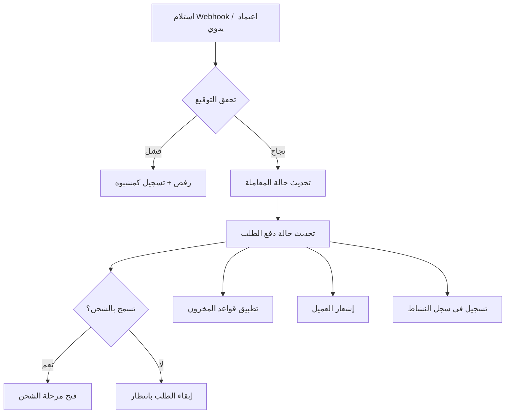

### 5) جدول الشاشات
| الشاشة | الوظيفة | الحالة |
|---|---|---|
| (لا توجد شاشة تفاعلية بشرية) | العملية آلية بالكامل | — |
| صفحة تفاصيل الطلب (تحديث حالة تلقائي) | يرى العميل/الموظف الحالة الجديدة عند فتحها لاحقًا | ♻️ |

---

## UF-05: إنشاء الشحنة وربطها بالطلب

### 1) معلومات التدفق
| البيان | القيمة |
|---|---|
| **رقم التدفق** | UF-05 |
| **اسم التدفق** | إنشاء الشحنة وربطها بالطلب |
| **الهدف** | تجهيز طلب مؤكَّد الدفع للشحن الفعلي، مع تحديد شركة الشحن وتفاصيلها |
| **الممثلون المشاركون** | موظف الشحن (ACT-10)، مدير العمليات (ACT-09) |
| **حالات الاستخدام المرتبطة** | UC-SOD-01, UC-ZON-09, UC-CAR-08, UC-SHP-07 |

### 2) المسار الرئيسي
1. يفتح موظف الشحن قائمة "طلبات جاهزة للشحن" (مصفَّاة تلقائيًا حسب أهلية حالة الدفع).
2. يضغط الموظف على طلب محدد.
3. يعرض النظام تفاصيل الشحن المُنشأة تلقائيًا عند اعتماد الطلب (شركة الشحن، نوع الخدمة، التكلفة، عنوان الشحن).
4. يراجع الموظف صحة البيانات (شركة الشحن، مكتب الاستلام إن وُجد).
5. إن احتاج تعديلاً: يُعدّل الموظف شركة الشحن أو المكتب قبل الشحن الفعلي.
6. يضغط الموظف على "تجهيز للشحن" أو ينتقل مباشرة لتسجيل رقم التتبع (UF-06).

### 3) الفروع والاستثناءات
| الفرع | نقطة التفرع | الوصف | العودة/الإنهاء |
|---|---|---|---|
| A1 | الخطوة 1 | الطلب غير مؤهل (حالة دفع لا تسمح بالشحن) | لا يظهر ضمن القائمة أصلاً |
| A2 | الخطوة 5 | الشركة/المكتب المختار أصبح معطّلاً | يمنع النظام الحفظ ويعرض قائمة بدائل نشطة |
| A3 | الخطوة 5 | محاولة تعديل بعد الشحن الفعلي | يُمنع التعديل إلا عبر إجراء إداري موثّق |

### 4) المخطط البصري المختصر

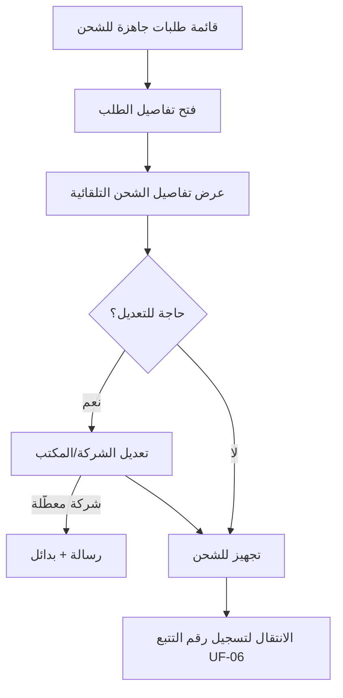

### 5) جدول الشاشات
| الشاشة | الوظيفة | الحالة |
|---|---|---|
| قائمة طلبات جاهزة للشحن | عرض الطلبات المؤهلة للشحن | 🆕 |
| قسم تفاصيل الشحن ضمن صفحة الطلب | عرض/تعديل بيانات الشحن | 🆕 |

---

## UF-06: تتبع الشحنة وتحديث حالتها

### 1) معلومات التدفق
| البيان | القيمة |
|---|---|
| **رقم التدفق** | UF-06 |
| **اسم التدفق** | تتبع الشحنة وتحديث حالتها |
| **الهدف** | تسجيل رقم التتبع، توليد رابط التتبع تلقائيًا، ومتابعة الشحنة حتى التسليم النهائي |
| **الممثلون المشاركون** | موظف الشحن (ACT-10)، شركة الشحن الخارجية (ACT-23)، العميل المسجل (ACT-21) |
| **حالات الاستخدام المرتبطة** | UC-SOD-02/03/04/05/07, UC-CAR-07 |

### 2) المسار الرئيسي
1. يستلم موظف الشحن رقم التتبع الفعلي من شركة الشحن بعد تسليم الشحنة لها.
2. يفتح الموظف قسم "التتبع" ضمن تفاصيل شحن الطلب.
3. يُدخل الموظف رقم التتبع.
4. يولّد النظام رابط التتبع تلقائيًا من قالب الشركة.
5. يحفظ النظام رقم ورابط التتبع، ويُحدّث حالة الشحنة إلى "تم الشحن".
6. يُسجّل النظام تاريخ الشحن الفعلي.
7. يُرسل النظام إشعارًا للعميل يتضمن رابط التتبع.
8. يفتح العميل صفحة طلبه ويضغط على "تتبع الشحنة" للانتقال لصفحة تتبع الشركة الخارجية.
9. عند وصول الشحنة فعليًا: يُحدّث الموظف (أو تكامل خارجي تلقائي) الحالة إلى "تم التسليم".
10. يُسجّل النظام تاريخ التسليم النهائي كسجل تاريخي ثابت.
11. يُرسل النظام إشعار "تم التسليم" للعميل.

### 3) الفروع والاستثناءات
| الفرع | نقطة التفرع | الوصف | العودة/الإنهاء |
|---|---|---|---|
| A1 | الخطوة 4 | الشركة لا تدعم توليد رابط تتبع مباشر | يُستخدم البديل المُعرَّف مسبقًا (رابط عام أو تعليمات نصية) |
| A2 | الخطوة 9 | تعثر أو تأخر التسليم | تُحدَّث الحالة إلى "متعثرة"، إشعار اختياري للعميل حسب السياسة |
| A3 | الخطوة 10 | محاولة تعديل بيانات الشحن بعد التسليم النهائي | يُمنع إلا عبر إجراء إداري موثّق |

### 4) المخطط البصري المختصر

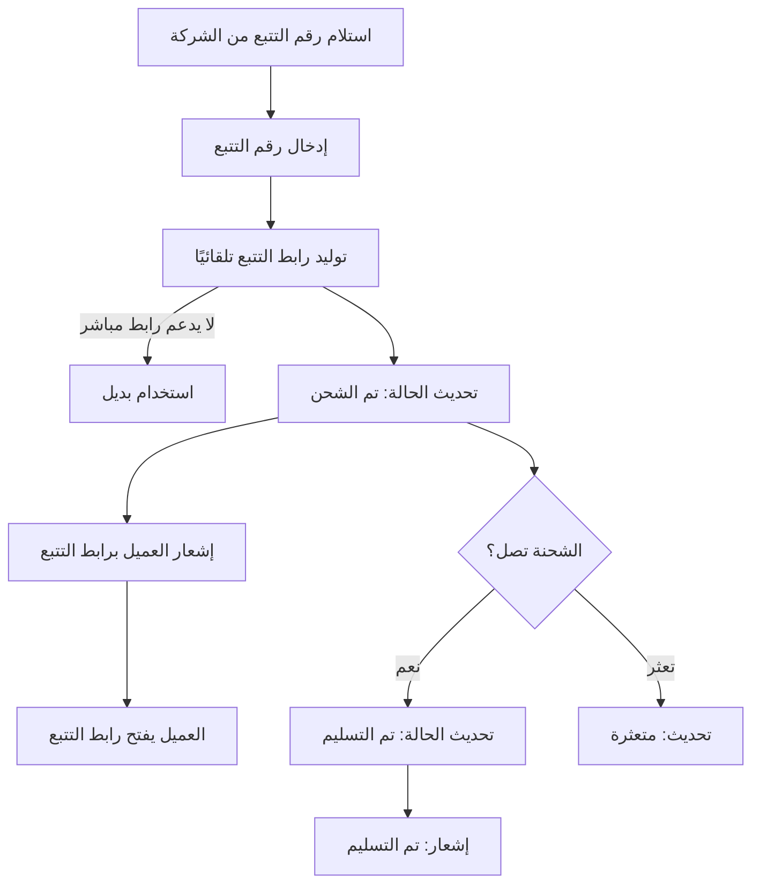

### 5) جدول الشاشات
| الشاشة | الوظيفة | الحالة |
|---|---|---|
| قسم التتبع ضمن تفاصيل الطلب | إدخال رقم التتبع وعرض الرابط | 🆕 |
| صفحة تتبع الشحنة (خارجية) | تتبع فعلي عبر موقع شركة الشحن | 🆕 (خارج النظام) |
| صفحة تفاصيل الطلب — قسم الشحن (للعميل) | عرض حالة الشحنة ورابط التتبع للعميل | ♻️ |

---

## UF-07: إضافة تقييم بعد الشراء

### 1) معلومات التدفق
| البيان | القيمة |
|---|---|
| **رقم التدفق** | UF-07 |
| **اسم التدفق** | إضافة تقييم بعد الشراء |
| **الهدف** | تمكين العميل من تقييم منتج اشتراه فعليًا، مع إمكانية إرفاق وسائط |
| **الممثلون المشاركون** | العميل المسجل (ACT-21)، موظف المراجعة والإشراف (ACT-14) |
| **حالات الاستخدام المرتبطة** | UC-ITEM-04, UC-REV-01, UC-RMW-01, UC-REV-03 |

### 2) المسار الرئيسي
1. يفتح العميل صفحة "طلباتي" ويجد طلبًا بحالة "تم التسليم".
2. يضغط العميل على "أضف تقييمًا" بجانب منتج ضمن الطلب.
3. يتحقق النظام من إثبات الشراء (تلقائي).
4. يعرض النظام نموذج التقييم.
5. يُدخل العميل درجة رقمية (1-5) ونص التقييم.
6. يُرفق العميل صورًا/فيديو اختياريًا.
7. يضغط العميل "إرسال".
8. يحفظ النظام التقييم بحالة "قيد المراجعة" (أو "منشور" مباشرة وفق السياسة).
9. يظهر التقييم في صفحة المنتج بعد اعتماده من موظف المراجعة (UC-REV-03، تدفق مستقل).

### 3) الفروع والاستثناءات
| الفرع | نقطة التفرع | الوصف | العودة/الإنهاء |
|---|---|---|---|
| A1 | الخطوة 3 | العميل لم يشترِ هذا المنتج فعليًا | لا يظهر زر "أضف تقييمًا" أصلاً لهذا المنتج |
| A2 | الخطوة 6 | فشل رفع الوسيط (حجم/امتداد) | تُعرض رسالة خطأ، يمكن إتمام التقييم النصي بدون الوسيط |
| A3 | الخطوة 8 | العميل قيَّم هذا المنتج من قبل | يُوجَّه لتعديل تقييمه الحالي بدلاً من إنشاء جديد |

### 4) المخطط البصري المختصر

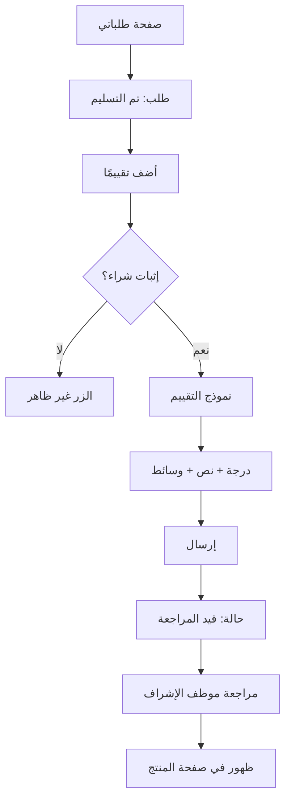

### 5) جدول الشاشات
| الشاشة | الوظيفة | الحالة |
|---|---|---|
| صفحة "طلباتي" | عرض الطلبات مع زر التقييم لكل عنصر مؤهل | 🆕 |
| نموذج التقييم | إدخال الدرجة والنص والوسائط | 🆕 |
| صفحة المنتج — قسم التقييمات | عرض التقييمات المعتمدة | 🆕 |

---

## UF-08: تقديم شكوى بعد الشراء ومتابعتها حتى الحل

### 1) معلومات التدفق
| البيان | القيمة |
|---|---|
| **رقم التدفق** | UF-08 |
| **اسم التدفق** | تقديم شكوى بعد الشراء ومتابعتها حتى الحل |
| **الهدف** | تمكين العميل من الإبلاغ عن مشكلة ومتابعتها حتى الحل وتقييم رضاه عنه |
| **الممثلون المشاركون** | العميل المسجل (ACT-21)، موظف خدمة العملاء (ACT-06) |
| **حالات الاستخدام المرتبطة** | UC-CMP-01 إلى UC-CMP-08 |

### 2) المسار الرئيسي
1. يفتح العميل صفحة الطلب المعني ويضغط "تقديم شكوى".
2. يعرض النظام نموذج الشكوى (مرتبط تلقائيًا بالطلب).
3. يُدخل العميل عنوانًا ووصفًا تفصيليًا، ويُرفق أدلة اختياريًا.
4. يضغط العميل "إرسال".
5. يحفظ النظام الشكوى بحالة "جديدة" مع رقم مرجعي.
6. يُصنّف موظف خدمة العملاء الشكوى ويُحدّد أولويتها، ويُسنِدها لنفسه أو لموظف آخر.
7. يتواصل الموظف مع العميل عبر سجل المراسلات (رد/رد).
8. يُحدّث الموظف الحالة تدريجيًا (قيد المعالجة → تم الحل).
9. عند "تم الحل": يُطلَب من العميل تقييم رضاه عن الحل.
10. يُدخل العميل درجة رضا وتعليقًا اختياريًا.
11. يُغلق الموظف الشكوى رسميًا.

### 3) الفروع والاستثناءات
| الفرع | نقطة التفرع | الوصف | العودة/الإنهاء |
|---|---|---|---|
| A1 | الخطوة 8 | الشكوى تحتاج معلومات إضافية من العميل | تُحدَّث الحالة إلى "بانتظار العميل"، إشعار للعميل، تعود لـ "قيد المعالجة" عند رده |
| A2 | الخطوة 9 | العميل لا يرد على طلب تقييم الرضا | تُغلَق الشكوى بعد مهلة زمنية دون درجة رضا (وفق سياسة المتجر) |
| A3 | بعد الخطوة 11 | العميل يطلب إعادة فتح الشكوى | يُتاح فقط إن سمحت السياسة، من مستخدم مخوّل |

### 4) المخطط البصري المختصر

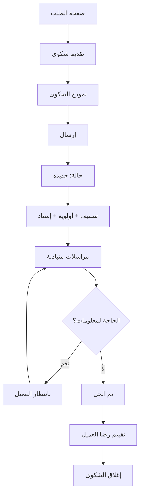

### 5) جدول الشاشات
| الشاشة | الوظيفة | الحالة |
|---|---|---|
| نموذج تقديم شكوى | إدخال تفاصيل الشكوى | 🆕 |
| صفحة تفاصيل الشكوى (للعميل) | متابعة الحالة والمراسلات | 🆕 |
| شاشة إدارة الشكاوى (للموظف) | تصنيف، إسناد، رد، تحديث حالة | 🆕 |
| نموذج تقييم الرضا | تقييم الحل بعد الإغلاق | 🆕 |

---

## UF-09: تقديم بلاغ إساءة ومعالجته بسرية

### 1) معلومات التدفق
| البيان | القيمة |
|---|---|
| **رقم التدفق** | UF-09 |
| **اسم التدفق** | تقديم بلاغ إساءة ومعالجته بسرية |
| **الهدف** | تمكين أي مستخدم من الإبلاغ عن محتوى/سلوك مخالف مع حماية تامة لهويته |
| **الممثلون المشاركون** | العميل المسجل (ACT-21)، موظف المراجعة والإشراف (ACT-14) |
| **حالات الاستخدام المرتبطة** | UC-ABR-01 إلى UC-ABR-07 |

### 2) المسار الرئيسي
1. يضغط العميل على أيقونة "إبلاغ" بجانب تقييم/منتج/مستخدم آخر.
2. يعرض النظام نموذج البلاغ.
3. يختار العميل سبب البلاغ ويكتب وصفًا تفصيليًا، ويُرفق أدلة اختياريًا.
4. يضغط العميل "إرسال".
5. يحفظ النظام البلاغ **مع تشفير/عزل هوية المُبلِّغ داخليًا فقط**.
6. يُصنّف موظف المراجعة البلاغ ويُحدّد أولويته.
7. يفتح الموظف البلاغ **بصيغة مجهولة الهوية بالكامل** للمراجعة.
8. يُقرّر الموظف: اعتماد (ثبوت المخالفة) أو رفض.
9. عند الاعتماد: يختار الموظف الإجراء المناسب (حذف/إخفاء/تحذير/حظر) وينفّذه.
10. يُرسل النظام إشعارًا للمُبلِّغ بنتيجة المراجعة **دون كشف أي تفاصيل عن الطرف الآخر**.

### 3) الفروع والاستثناءات
| الفرع | نقطة التفرع | الوصف | العودة/الإنهاء |
|---|---|---|---|
| A1 | الخطوة 8 | البلاغ غير صحيح (لا مخالفة فعلية) | يُرفَض مع حفظ السبب، لا يُحذَف البلاغ، إشعار للمُبلِّغ بعدم ثبوت المخالفة |
| A2 | الخطوة 9 | مخالفة جسيمة تستدعي حظرًا فوريًا | يُتَّخذ إجراء الحظر مباشرة مع تسجيل كامل التفاصيل |
| A3 | أي خطوة | محاولة كشف هوية المُبلِّغ من أي واجهة | مرفوضة بنيويًا؛ لا توجد واجهة تُظهر هذه المعلومة لغير المخوَّلين |

### 4) المخطط البصري المختصر

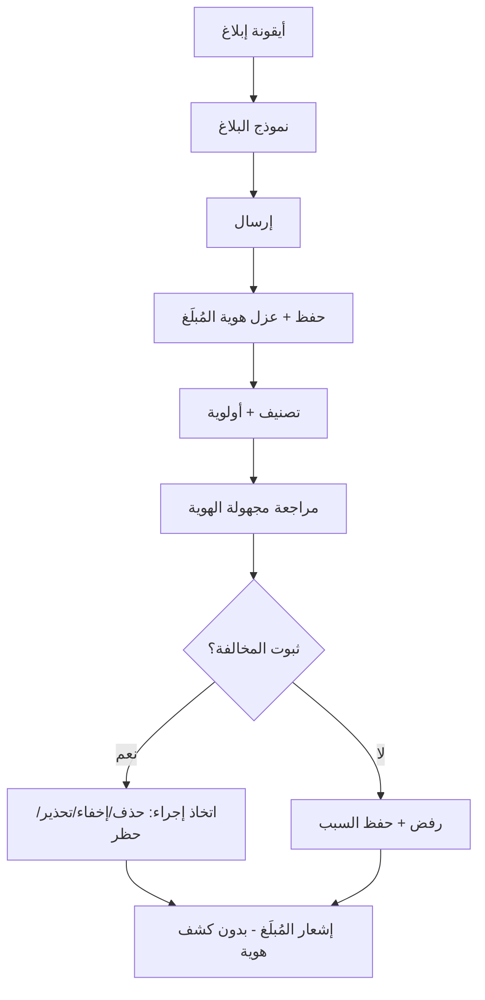

### 5) جدول الشاشات
| الشاشة | الوظيفة | الحالة |
|---|---|---|
| نموذج تقديم بلاغ | إدخال سبب ووصف البلاغ | 🆕 |
| شاشة مراجعة البلاغات (مجهولة الهوية) | فحص واتخاذ قرار | 🆕 |
| نموذج اتخاذ الإجراء | اختيار وتوثيق الإجراء المتَّخذ | 🆕 |

---

## UF-10: التدقيق الرقابي الشامل لأي عملية في النظام

### 1) معلومات التدفق
| البيان | القيمة |
|---|---|
| **رقم التدفق** | UF-10 |
| **اسم التدفق** | التدقيق الرقابي الشامل لأي عملية في النظام |
| **الهدف** | تمكين المدقق من تتبع أي عملية حدثت في النظام من مصدرها الأصلي عبر سجل النشاط الموحَّد |
| **الممثلون المشاركون** | المدقق الداخلي (ACT-17)، مدير النظام (ACT-15) |
| **حالات الاستخدام المرتبطة** | UC-LOG-01 إلى UC-LOG-09, UC-RET-06 |

> **ملاحظة:** هذا تدفق **تجميعي** يوضح كيف يتقاطع سجل النشاط مع كل الأقسام الأخرى، وليس تدفقًا لعملية تجارية واحدة.

### 2) المسار الرئيسي
1. يفتح المدقق شاشة "سجلات النشاط".
2. يبحث المدقق عن حدث محدد (بالمستخدم/النوع/الفترة/IP).
3. يعرض النظام نتائج مطابقة.
4. يفتح المدقق سجلاً لعرض تفاصيله الكاملة (القيمة القديمة/الجديدة، السياق).
5. يتتبَّع المدقق مصدر الحدث (أي قسم/كيان تأثَّر).
6. عند اكتشاف نمط مشبوه: يُصعِّد المدقق الأمر لمدير النظام.
7. يُصدِّر المدقق تقريرًا للأرشفة أو التدقيق الخارجي.

### 3) الفروع والاستثناءات
| الفرع | نقطة التفرع | الوصف | العودة/الإنهاء |
|---|---|---|---|
| A1 | الخطوة 2 | لا نتائج مطابقة | رسالة توضيحية، يُعاد صياغة البحث |
| A2 | الخطوة 7 | المستخدم لا يملك صلاحية التصدير | يُمنَع الزر أصلاً وفق UC-LOG-09 |

### 4) المخطط البصري المختصر

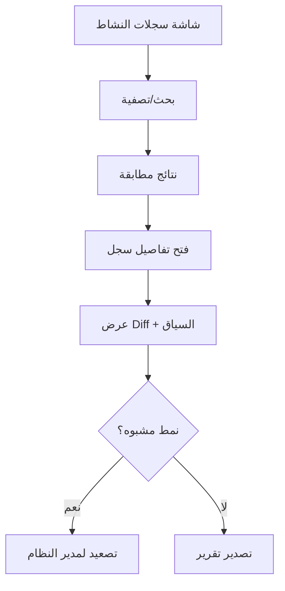

### 5) جدول الشاشات
| الشاشة | الوظيفة | الحالة |
|---|---|---|
| شاشة سجلات النشاط | بحث وتصفية شاملة | 🆕 |
| صفحة تفاصيل السجل | عرض Diff والسياق الكامل | 🆕 |

---

## UF-11: إلغاء طلب وإرجاع الكمية للمخزون

### 1) معلومات التدفق
| البيان | القيمة |
|---|---|
| **رقم التدفق** | UF-11 |
| **اسم التدفق** | إلغاء طلب وإرجاع الكمية للمخزون |
| **الهدف** | إلغاء طلب قبل الشحن مع إرجاع تلقائي للمخزون وفتح مسار استرداد إن كان مدفوعًا |
| **الممثلون المشاركون** | موظف المبيعات (ACT-05)، العميل المسجل (ACT-21) |
| **حالات الاستخدام المرتبطة** | UC-ORD-13, UC-OST-06, UC-VAR-11, UC-RFD-01 |

### 2) المسار الرئيسي
1. يفتح المستخدم (موظف أو عميل) صفحة تفاصيل الطلب.
2. يضغط على "إلغاء الطلب".
3. يطلب النظام تحديد سبب الإلغاء.
4. يُدخل المستخدم السبب.
5. يعرض النظام تأكيدًا نهائيًا يوضح الأثر (إرجاع المخزون، هل يوجد مبلغ مدفوع).
6. يؤكد المستخدم.
7. يُحدّث النظام حالة الطلب إلى "ملغى".
8. يُطبِّق النظام قواعد إرجاع المخزون تلقائيًا لكل عنصر.
9. إن كان الطلب مدفوعًا بالفعل: يُنبِّه النظام لإنشاء طلب استرداد (ينتقل تلقائيًا لتدفق UF-12).
10. يُرسل النظام إشعار إلغاء للعميل.

### 3) الفروع والاستثناءات
| الفرع | نقطة التفرع | الوصف | العودة/الإنهاء |
|---|---|---|---|
| A1 | الخطوة 1 | الطلب في حالة نهائية (تم التسليم) | يُمنَع الإلغاء، يُقترَح "طلب استرداد" كبديل |
| A2 | الخطوة 6 | المستخدم يلغي التأكيد | لا يتغير شيء، يعود لصفحة الطلب |

### 4) المخطط البصري المختصر

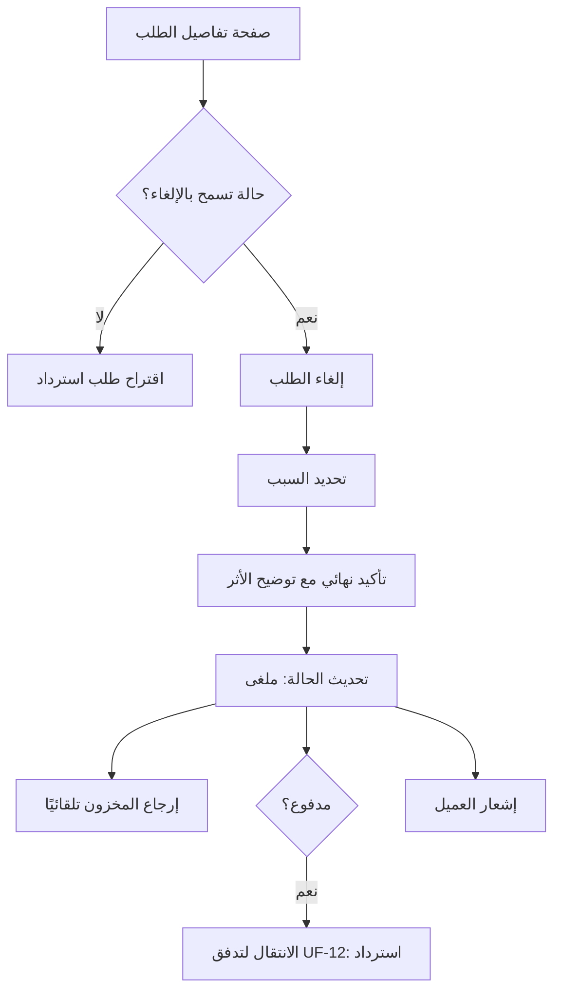

### 5) جدول الشاشات
| الشاشة | الوظيفة | الحالة |
|---|---|---|
| صفحة تفاصيل الطلب | نقطة البدء | ♻️ |
| نموذج سبب الإلغاء | إدخال السبب والتأكيد النهائي | 🆕 |

---

## UF-12: استرداد مالي كامل لطلب (إلغاء بعد الدفع)

### 1) معلومات التدفق
| البيان | القيمة |
|---|---|
| **رقم التدفق** | UF-12 |
| **اسم التدفق** | استرداد مالي كامل لطلب |
| **الهدف** | إعادة المبلغ المدفوع للعميل بعد إلغاء أو شكوى مقبولة، مع تزامن حالة الدفع والمخزون |
| **الممثلون المشاركون** | المحقق المالي (ACT-07)، المدير العام (ACT-01) |
| **حالات الاستخدام المرتبطة** | UC-RFD-01 إلى UC-RFD-07, UC-PST-08, UC-VAR-11, UC-ORD-09 |

### 2) المسار الرئيسي
1. يفتح المحقق المالي صفحة الطلب (وصولًا من UF-11 أو مباشرة).
2. يضغط على "إنشاء طلب استرداد".
3. يختار "استرداد كلي".
4. يمنح النظام رقمًا مرجعيًا فريدًا للاسترداد.
5. يُحدّد المحقق سبب الاسترداد.
6. يُرسَل الطلب للمراجعة (قد يكون المحقق نفسه أو مستوى أعلى).
7. يُعتمَد طلب الاسترداد.
8. يختار المحقق وسيلة التنفيذ (نفس وسيلة الدفع/رصيد المتجر/تحويل بنكي).
9. يُنفَّذ الاسترداد (عبر API للبوابة، أو يدويًا).
10. يُحدّث النظام حالة الدفع تلقائيًا إلى "مسترد كليًا".
11. يُرسل النظام إشعارًا للعميل.

### 3) الفروع والاستثناءات
| الفرع | نقطة التفرع | الوصف | العودة/الإنهاء |
|---|---|---|---|
| A1 | الخطوة 7 | رفض طلب الاسترداد | يُسجَّل السبب، لا تتأثر حالة الدفع/الطلب |
| A2 | الخطوة 9 | فشل تنفيذ الاسترداد عبر البوابة | يُسجَّل سبب الفشل، يُتاح إعادة المحاولة، لا فقدان للبيانات |

### 4) المخطط البصري المختصر

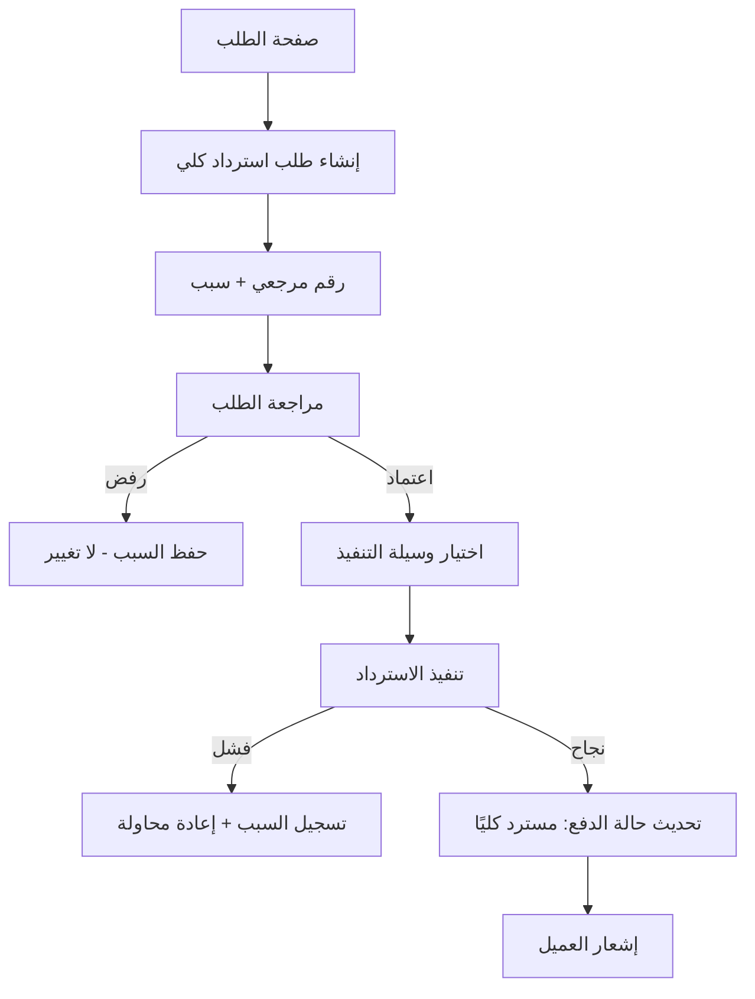

### 5) جدول الشاشات
| الشاشة | الوظيفة | الحالة |
|---|---|---|
| نموذج إنشاء طلب استرداد | تحديد النوع، السبب، المبلغ | 🆕 |
| شاشة مراجعة طلبات الاسترداد | اعتماد/رفض | 🆕 |
| نموذج تنفيذ الاسترداد | اختيار الوسيلة وتأكيد التنفيذ | 🆕 |

---

## UF-13: بناء واجهة تسويقية مركّبة (بطاقة + مجموعة + قاعدة ديناميكية)

### 1) معلومات التدفق
| البيان | القيمة |
|---|---|
| **رقم التدفق** | UF-13 |
| **اسم التدفق** | بناء واجهة تسويقية مركّبة |
| **الهدف** | تمكين مدير التسويق من إنشاء بطاقة عرض تجمع منتجات يدوية وقاعدة ديناميكية معًا |
| **الممثلون المشاركون** | مدير التسويق (ACT-12) |
| **حالات الاستخدام المرتبطة** | UC-DC-05/06, UC-COL-01/03/06, UC-DYN-01/06/09 |

### 2) المسار الرئيسي
1. يفتح مدير التسويق "إنشاء بطاقة عرض جديدة".
2. يُدخل بيانات البطاقة الأساسية (عنوان، صفحة مستهدفة، نمط عرض).
3. يفتح قسم "ربط المحتوى" ويختار "مجموعة منتجات".
4. ينشئ مجموعة جديدة أو يختار موجودة، ويُضيف منتجات يدويًا ويرتّبها.
5. يفتح قسم "القاعدة الديناميكية" ويربط قاعدة موجودة (مثل "الأكثر مبيعًا") لاستكمال العدد.
6. يضغط "معاينة النتائج" ليرى بالضبط ما سيظهر للعميل (يدوي أولًا، ثم ديناميكي).
7. يضبط الجدولة (تاريخ بدء/انتهاء) والاستهداف.
8. يحفظ ويُنشر البطاقة.

### 3) الفروع والاستثناءات
| الفرع | نقطة التفرع | الوصف | العودة/الإنهاء |
|---|---|---|---|
| A1 | الخطوة 6 | القاعدة الديناميكية لا تُنتج عددًا كافيًا | تُعرض العناصر المتاحة فقط، مع رسالة توضيحية |
| A2 | الخطوة 4 | محاولة إضافة منتج مكرر للمجموعة | يُمنع النظام الإضافة |

### 4) المخطط البصري المختصر

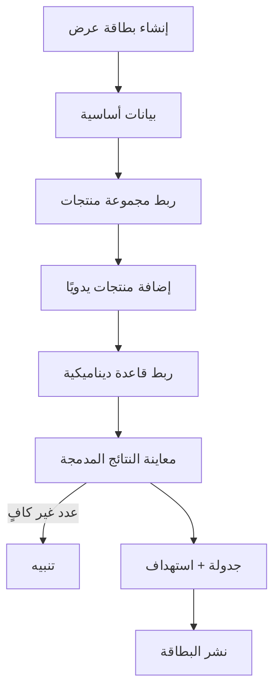

### 5) جدول الشاشات
| الشاشة | الوظيفة | الحالة |
|---|---|---|
| نموذج إنشاء بطاقة عرض | البيانات الأساسية والتصميم والجدولة | 🆕 |
| شاشة إدارة منتجات المجموعة | إضافة/ترتيب المنتجات | ♻️ (من القسم 7) |
| شاشة إنشاء/اختيار قاعدة ديناميكية | ربط القاعدة بالبطاقة | 🆕 |
| معاينة النتائج المدمجة | عرض حي لما سيظهر للعميل | 🆕 |

---

## UF-14: تسجيل الدخول مع دمج سلة الزائر

### 1) معلومات التدفق
| البيان | القيمة |
|---|---|
| **رقم التدفق** | UF-14 |
| **اسم التدفق** | تسجيل الدخول مع دمج سلة الزائر |
| **الهدف** | ضمان عدم فقدان عناصر سلة الزائر عند تسجيل دخوله لحساب له سلة مسبقة |
| **الممثلون المشاركون** | الزائر (ACT-20) → العميل المسجل (ACT-21)، النظام |
| **حالات الاستخدام المرتبطة** | UC-CUST-02, UC-CART-05 |

### 2) المسار الرئيسي
1. يتصفح الزائر المتجر ويُضيف عناصر لسلته (بدون حساب).
2. يضغط الزائر على "تسجيل الدخول".
3. يُدخل بيانات دخوله ويضغط "دخول".
4. يتحقق النظام من صحة البيانات.
5. يتحقق النظام من وجود سلة سابقة مرتبطة بحساب العميل.
6. يدمج النظام عناصر السلتين (جمع الكميات المتماثلة، إضافة غير المتماثلة).
7. تصبح السلة الموحَّدة السلة النشطة الوحيدة.
8. يُوجَّه العميل للصفحة التي كان يتصفحها، مع أيقونة السلة مُحدَّثة بالعدد الصحيح.

### 3) الفروع والاستثناءات
| الفرع | نقطة التفرع | الوصف | العودة/الإنهاء |
|---|---|---|---|
| A1 | الخطوة 4 | بيانات دخول خاطئة | رسالة خطأ عامة، يبقى في نموذج الدخول |
| A2 | الخطوة 5 | لا توجد سلة سابقة للعميل | تُصبح سلة الزائر هي سلة العميل مباشرة دون دمج |
| A3 | الخطوة 6 | عنصر من سلة الزائر لم يعد متوفرًا | يُدمَج مع تعليم "غير متوفر" ليتعامل معه العميل لاحقًا |

### 4) المخطط البصري المختصر

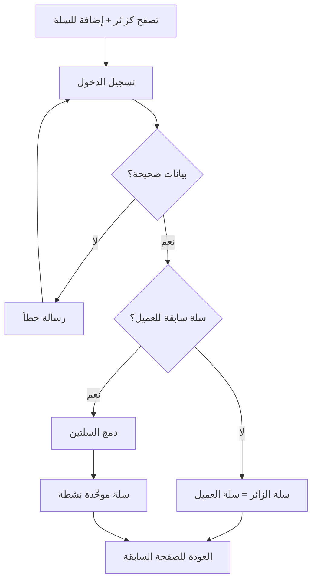

### 5) جدول الشاشات
| الشاشة | الوظيفة | الحالة |
|---|---|---|
| نموذج تسجيل الدخول | إدخال بيانات الدخول | 🆕 |
| سلة التسوق (بعد الدمج) | عرض السلة الموحَّدة | ♻️ (من UF-01) |

---

## UF-15: التحقق من الصلاحية قبل تنفيذ أي عملية حساسة

### 1) معلومات التدفق
| البيان | القيمة |
|---|---|
| **رقم التدفق** | UF-15 |
| **اسم التدفق** | التحقق من الصلاحية قبل تنفيذ أي عملية حساسة |
| **الهدف** | ضمان أن أي مستخدم لا يستطيع تنفيذ عملية لا يمتلك صلاحيتها، عبر الواجهة أو مباشرة |
| **الممثلون المشاركون** | أي موظف، النظام |
| **حالات الاستخدام المرتبطة** | UC-ROLE-06, UC-LOG-01 |

> **ملاحظة:** هذا تدفق **آلي/بنيوي** يحدث خلف كل عملية حساسة في النظام تقريبًا، ويُذكر هنا كتدفق مرجعي مستقل لأنه "بوّابة" تُستدعى من كل التدفقات الأخرى.

### 2) المسار الرئيسي
1. يضغط الموظف على إجراء يتطلب صلاحية (مثال: "حذف منتج").
2. يتحقق النظام (خادميًا) من صلاحيات كل أدوار المستخدم المُسنَدة إليه.
3. إن وُجدت الصلاحية المطلوبة: يُنفَّذ الإجراء بشكل طبيعي.
4. إن لم توجد: يُمنَع فورًا، وتُسجَّل المحاولة في سجل النشاط.

### 3) الفروع والاستثناءات
| الفرع | نقطة التفرع | الوصف | العودة/الإنهاء |
|---|---|---|---|
| A1 | الخطوة 1 | عنصر الواجهة نفسه مخفي أصلاً (المستخدم لا يملك الصلاحية) | لا يظهر الزر/الرابط للمستخدم من الأساس |
| A2 | الخطوة 4 | محاولة تنفيذ مباشرة عبر رابط/API بدون صلاحية | يُرفَض على مستوى الخادم دائمًا، بصرف النظر عن حالة الواجهة |

### 4) المخطط البصري المختصر

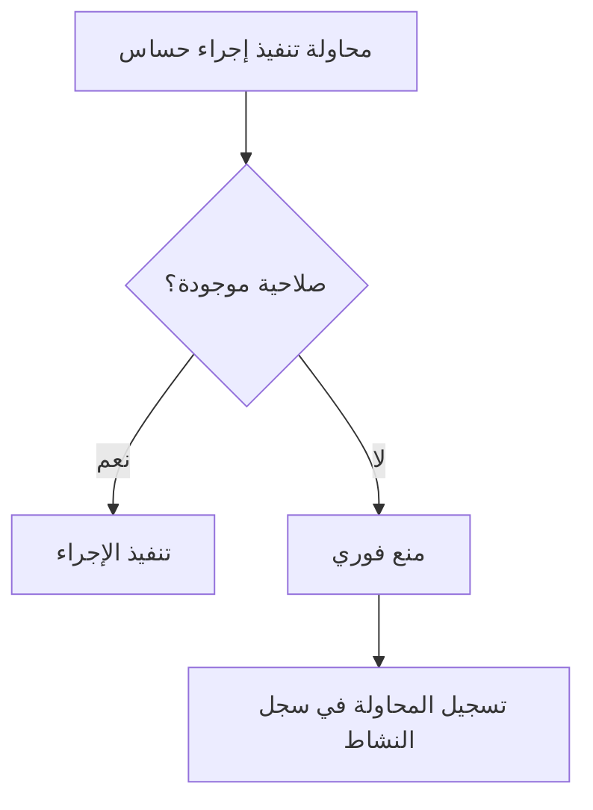

### 5) جدول الشاشات
| الشاشة | الوظيفة | الحالة |
|---|---|---|
| (لا توجد شاشة مستقلة) | تحقق خلفي يعمل عبر كل شاشات النظام | — |
| رسالة "غير مصرَّح" | تظهر عند أي محاولة مباشرة غير مصرَّح بها | 🆕 |

---

## خاتمة المجموعة الأولى

اكتملت **التدفقات المتداخلة (UF-01 إلى UF-15)**، وهي الأكثر تعقيدًا في النظام لأنها تعبر أكثر من إدارة. هذه التدفقات ستكون **العمود الفقري** لخريطة التنقل (Navigation Map) القادمة، حيث ستُجمَّع كل الشاشات المذكورة في "جدول الشاشات" لكل تدفق ضمن مخزون شاشات موحَّد لا تكرار فيه.

### ملخص الشاشات المُكتشفة حتى الآن (تمهيدًا لـ Screen Inventory)

| # | الشاشة | أول ظهور |
|---|---|---|
| 1 | سلة التسوق | UF-01 |
| 2 | معالج إتمام الطلب (عنوان/تسليم/دفع) | UF-01 |
| 3 | نموذج إضافة عنوان جديد | UF-01 |
| 4 | ملخص الطلب النهائي | UF-01 |
| 5 | صفحة تأكيد الطلب | UF-01 |
| 6 | صفحة تفاصيل الطلب | UF-01/متكررة |
| 7 | نموذج رفع إثبات الدفع | UF-02 |
| 8 | قائمة معاملات بانتظار المراجعة | UF-03 |
| 9 | صفحة تفاصيل المعاملة + عارض صور مكبَّر | UF-03 |
| 10 | قائمة طلبات جاهزة للشحن | UF-05 |
| 11 | قسم تفاصيل/تتبع الشحن | UF-05/UF-06 |
| 12 | صفحة تتبع خارجية | UF-06 |
| 13 | صفحة "طلباتي" | UF-07 |
| 14 | نموذج التقييم | UF-07 |
| 15 | صفحة المنتج — قسم التقييمات | UF-07 |
| 16 | نموذج تقديم شكوى + صفحة تفاصيلها | UF-08 |
| 17 | شاشة إدارة الشكاوى (موظف) | UF-08 |
| 18 | نموذج تقييم الرضا | UF-08 |
| 19 | نموذج تقديم بلاغ | UF-09 |
| 20 | شاشة مراجعة البلاغات (مجهولة الهوية) | UF-09 |
| 21 | شاشة سجلات النشاط + تفاصيل السجل | UF-10 |
| 22 | نموذج سبب الإلغاء | UF-11 |
| 23 | نموذج إنشاء/مراجعة/تنفيذ الاسترداد | UF-12 |
| 24 | نموذج إنشاء بطاقة عرض | UF-13 |
| 25 | شاشة إدارة منتجات المجموعة | UF-13 |
| 26 | شاشة إنشاء/اختيار قاعدة ديناميكية | UF-13 |
| 27 | نموذج تسجيل الدخول | UF-14 |
| 28 | رسالة "غير مصرَّح" | UF-15 |

> هذا الملخص أوّلي وسيُنقَّح ويُدمَج بشاشات مشابهة عند بناء **Screen Inventory** الرسمي بعد إكمال بقية تدفقات الأقسام التسعة.

