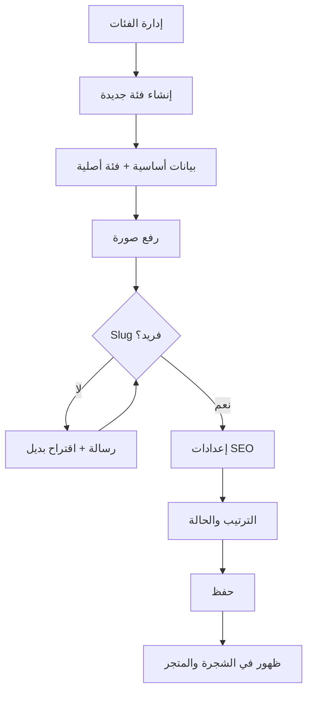
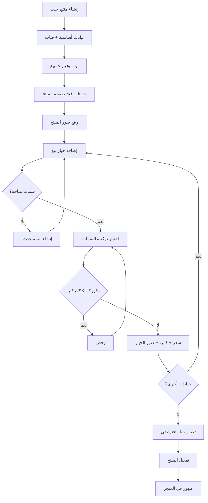
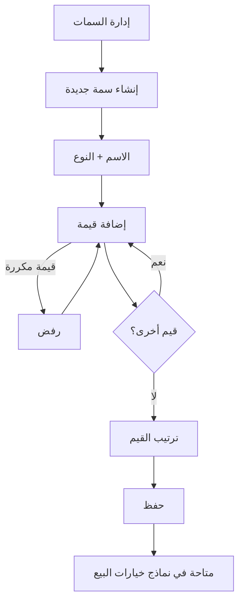
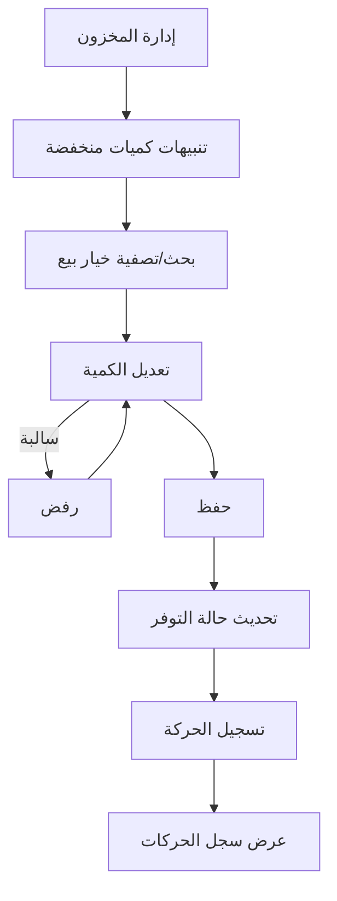
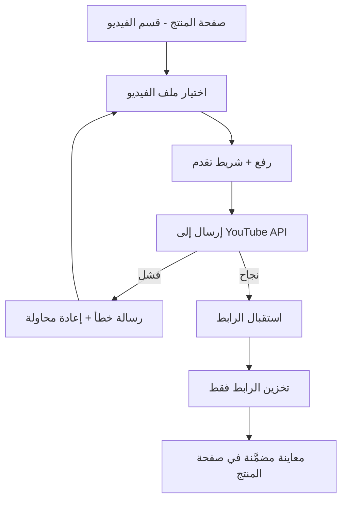

# وثيقة تدفقات المستخدم (User Flows)
## نظام Wow Shopping — الإصدار 1.0
### المجموعة الثانية: تدفقات القسم 1 — الإدارة العامة للمنتجات والمخزون

> **ملاحظة منهجية:** لا نُوثِّق تدفقًا مستقلاً لكل حالة استخدام (بعضها بسيط بخطوة واحدة كـ"تفعيل/تعطيل"، لا يستحق تدفقًا كاملاً). نختار فقط **التدفقات التي تضم عدة حالات استخدام مترابطة معًا في رحلة عمل واحدة ذات قيمة**. الحالات المتبقية (البحث، التصفية، العرض البسيط) ستُغطَّى لاحقًا كأنماط شاشة موحَّدة ضمن Screen Inventory دون الحاجة لتدفق مستقل لكل منها.
>
> **القالب المعتمد لكل تدفق:** معلومات التدفق ← المسار الرئيسي ← الفروع والاستثناءات ← المخطط البصري المختصر ← جدول الشاشات.

---

## UF-16: بناء فئة جديدة كاملة (من الإنشاء إلى الظهور في المتجر)

### 1) معلومات التدفق
| البيان | القيمة |
|---|---|
| **رقم التدفق** | UF-16 |
| **اسم التدفق** | بناء فئة جديدة كاملة |
| **الهدف** | تمكين موظف المحتوى من إنشاء فئة كاملة البيانات (هيكل، محتوى، SEO) وإظهارها في المتجر |
| **الممثلون المشاركون** | موظف المحتوى (ACT-02) |
| **حالات الاستخدام المرتبطة** | UC-CAT-01, UC-CAT-04, UC-CAT-06, UC-CAT-07, UC-CAT-09/10 |

### 2) المسار الرئيسي
1. يفتح الموظف شاشة "إدارة الفئات" ويضغط "إنشاء فئة جديدة".
2. يُدخل الاسم والوصف، ويختار الفئة الأصلية (إن كانت فرعية).
3. يرفع صورة/أيقونة الفئة.
4. يُدخل Slug يدويًا أو يتركه ليُولَّد تلقائيًا، ويتحقق النظام من تفرّده.
5. يفتح قسم SEO ويُضيف عنوان/وصف تعريفي.
6. يحدد ترتيب الظهور وحالة الفئة (ظاهرة).
7. يضغط "حفظ".
8. تظهر الفئة في شجرة الفئات بلوحة التحكم وفي واجهة المتجر فورًا.

### 3) الفروع والاستثناءات
| الفرع | نقطة التفرع | الوصف | العودة/الإنهاء |
|---|---|---|---|
| A1 | الخطوة 4 | Slug مكرر | رسالة خطأ فورية، يُقترح بديل تلقائي |
| A2 | الخطوة 6 | الحالة = مخفية | الفئة تُحفظ لكن لا تظهر في واجهة المتجر |

### 4) المخطط البصري المختصر

### 5) جدول الشاشات
| الشاشة | الوظيفة | الحالة |
|---|---|---|
| شاشة إدارة الفئات (شجرة) | نقطة البدء والعرض النهائي | 🆕 |
| نموذج إنشاء/تعديل فئة | إدخال كل بيانات الفئة | 🆕 |

---

## UF-17: بناء منتج كامل بخيارات بيع متعددة

### 1) معلومات التدفق
| البيان | القيمة |
|---|---|
| **رقم التدفق** | UF-17 |
| **اسم التدفق** | بناء منتج كامل بخيارات بيع متعددة |
| **الهدف** | تمكين موظف المنتجات من إنشاء منتج رئيسي، ثم بناء خيارات بيعه المتعددة اعتمادًا على السمات |
| **الممثلون المشاركون** | موظف إدارة المنتجات (ACT-03) |
| **حالات الاستخدام المرتبطة** | UC-PROD-01, UC-PROD-05, UC-PROD-06, UC-PROD-07, UC-ATTR-06, UC-VAR-01, UC-VAR-04/05, UC-VAR-08 |

### 2) المسار الرئيسي
1. يفتح الموظف "إنشاء منتج جديد".
2. يُدخل الاسم، الوصف، العلامة التجارية، ويربط المنتج بفئة واحدة أو أكثر.
3. يختار نوع المنتج: "رئيسي بخيارات بيع".
4. يحفظ البيانات الأساسية، يُوجَّه لصفحة المنتج.
5. يرفع صور المنتج الأساسي ويُحدّد الصورة الرئيسية.
6. يفتح قسم "خيارات البيع" ويضغط "إضافة خيار بيع".
7. يختار تركيبة سمات (مثل: اللون = أحمر، المقاس = كبير) من السمات المُعرَّفة مسبقًا.
8. يُدخل SKU (أو يُولَّد تلقائيًا)، السعر، الكمية.
9. يرفع صورًا خاصة بهذا الخيار (اختياري).
10. يحفظ الخيار الأول، ثم يكرر الخطوات 6-9 لكل تركيبة سمات إضافية.
11. يُعيّن أحد الخيارات كـ"افتراضي".
12. يُفعِّل المنتج، فيظهر في واجهة المتجر بكل خياراته.

### 3) الفروع والاستثناءات
| الفرع | نقطة التفرع | الوصف | العودة/الإنهاء |
|---|---|---|---|
| A1 | الخطوة 7 | لا توجد سمات مُعرَّفة مسبقًا | يُوجَّه الموظف لإنشاء سمة جديدة أولاً (رابط سريع لشاشة السمات)، ثم يعود لإكمال خيار البيع |
| A2 | الخطوة 8 | SKU مكرر | رسالة رفض فورية |
| A3 | الخطوة 7 | تركيبة السمات مكررة لخيار موجود بالفعل لنفس المنتج | يُمنع الحفظ |
| A4 | الخطوة 12 | لا توجد أي خيارات بيع نشطة عند التفعيل | المنتج يُحفظ مفعّلاً في قاعدة البيانات لكنه يبقى مخفيًا في الواجهة الأمامية |

### 4) المخطط البصري المختصر

### 5) جدول الشاشات
| الشاشة | الوظيفة | الحالة |
|---|---|---|
| نموذج إنشاء منتج | البيانات الأساسية | 🆕 |
| صفحة تفاصيل المنتج | مركز إدارة كل أقسام المنتج | 🆕 |
| قسم صور المنتج | رفع وترتيب الصور | 🆕 |
| نموذج إنشاء خيار بيع | السمات، SKU، السعر، الكمية، الصور | 🆕 |
| شاشة إدارة السمات (اختصار) | إنشاء سمة جديدة عند الحاجة | ♻️ (UF-18) |

---

## UF-18: تعريف سمة جديدة وقيمها لإعادة الاستخدام

### 1) معلومات التدفق
| البيان | القيمة |
|---|---|
| **رقم التدفق** | UF-18 |
| **اسم التدفق** | تعريف سمة جديدة وقيمها |
| **الهدف** | بناء سمة مركزية (مثل اللون) بكل قيمها لإعادة استخدامها عبر منتجات متعددة |
| **الممثلون المشاركون** | موظف إدارة المنتجات (ACT-03) |
| **حالات الاستخدام المرتبطة** | UC-ATTR-01, UC-ATTR-02, UC-ATTR-09 |

### 2) المسار الرئيسي
1. يفتح الموظف "إدارة السمات" ويضغط "إنشاء سمة جديدة".
2. يُدخل اسم السمة (مثل: اللون) ونوعها (لون).
3. يُضيف قيمة أولى (مثل: أحمر) مع كود HEX.
4. يكرر الإضافة لكل قيمة (أزرق، أخضر...).
5. يُرتّب القيم بالسحب والإفلات.
6. يحفظ السمة.
7. تصبح السمة متاحة فورًا للاختيار عند إنشاء أي خيار بيع لأي منتج (UF-17).

### 3) الفروع والاستثناءات
| الفرع | نقطة التفرع | الوصف | العودة/الإنهاء |
|---|---|---|---|
| A1 | الخطوة 4 | قيمة مكررة داخل نفس السمة | يمنع النظام الإضافة |

### 4) المخطط البصري المختصر

### 5) جدول الشاشات
| الشاشة | الوظيفة | الحالة |
|---|---|---|
| شاشة إدارة السمات | قائمة السمات + إنشاء جديدة | 🆕 |
| نموذج إنشاء/تعديل سمة | الاسم، النوع، القيم، الترتيب | 🆕 |

---

## UF-19: إدارة المخزون اليومية وسجل حركاته

### 1) معلومات التدفق
| البيان | القيمة |
|---|---|
| **رقم التدفق** | UF-19 |
| **اسم التدفق** | إدارة المخزون اليومية وسجل حركاته |
| **الهدف** | تمكين موظف المخزون من تحديث الكميات يدويًا ومتابعة سجل الحركات والتنبيهات |
| **الممثلون المشاركون** | موظف المخزون (ACT-04) |
| **حالات الاستخدام المرتبطة** | UC-VAR-06, UC-VAR-12, UC-VAR-10 |

### 2) المسار الرئيسي
1. يفتح موظف المخزون شاشة "إدارة المخزون".
2. يرى تنبيهات "كميات منخفضة" في أعلى الشاشة (إن وُجدت).
3. يبحث عن خيار بيع محدد أو يُصفّي حسب التوفر.
4. يفتح خيار البيع ويُعدّل الكمية يدويًا.
5. يحفظ التغيير.
6. يُحدّث النظام حالة التوفر تلقائيًا ويُسجّل الحركة.
7. يفتح الموظف "سجل حركات المخزون" لمراجعة تاريخ التغييرات لهذا الخيار.

### 3) الفروع والاستثناءات
| الفرع | نقطة التفرع | الوصف | العودة/الإنهاء |
|---|---|---|---|
| A1 | الخطوة 4 | إدخال كمية سالبة | رفض فوري مع رسالة توضيحية |
| A2 | الخطوة 5 | الكمية الجديدة = صفر | حالة التوفر تتحول تلقائيًا لـ"غير متاح"، يختفي من خيارات الشراء |

### 4) المخطط البصري المختصر

### 5) جدول الشاشات
| الشاشة | الوظيفة | الحالة |
|---|---|---|
| شاشة إدارة المخزون | قائمة الخيارات + تنبيهات + بحث | 🆕 |
| نموذج تعديل الكمية | تعديل سريع للكمية | 🆕 |
| سجل حركات المخزون | تاريخ كامل للتغييرات | 🆕 |

---

## UF-20: رفع فيديو تعريفي للمنتج عبر YouTube

### 1) معلومات التدفق
| البيان | القيمة |
|---|---|
| **رقم التدفق** | UF-20 |
| **اسم التدفق** | رفع فيديو تعريفي للمنتج عبر YouTube |
| **الهدف** | إضافة فيديو تعريفي لمنتج، يُرفع تلقائيًا لـ YouTube ويُخزَّن رابطه فقط |
| **الممثلون المشاركون** | موظف إدارة المنتجات (ACT-03)، YouTube API (ACT-24) |
| **حالات الاستخدام المرتبطة** | UC-PROD-06, UC-PROD-10 |

### 2) المسار الرئيسي
1. يفتح الموظف صفحة المنتج، قسم "فيديو المنتج".
2. يضغط "إضافة فيديو" ويختار ملف الفيديو من جهازه.
3. يبدأ الرفع؛ يعرض النظام شريط تقدم.
4. يُرسل النظام الفيديو لـ YouTube عبر API خلف الكواليس.
5. يستقبل النظام رابط الفيديو الناتج.
6. يُخزِّن النظام الرابط فقط (لا الملف نفسه) مرتبطًا بالمنتج.
7. يعرض النظام معاينة الفيديو المضمَّنة (Embed) في صفحة المنتج.

### 3) الفروع والاستثناءات
| الفرع | نقطة التفرع | الوصف | العودة/الإنهاء |
|---|---|---|---|
| A1 | الخطوة 4 | فشل الرفع لـ YouTube (انقطاع/خطأ API) | رسالة خطأ واضحة، لا يُخزَّن أي رابط، يُتاح إعادة المحاولة |
| A2 | أي خطوة | استبدال فيديو موجود بآخر جديد | يُحذف الرابط القديم ويُرفع الجديد بنفس المسار |

### 4) المخطط البصري المختصر

### 5) جدول الشاشات
| الشاشة | الوظيفة | الحالة |
|---|---|---|
| قسم فيديو المنتج | رفع ومعاينة الفيديو | 🆕 |

---

## خاتمة المجموعة الثانية

اكتملت تدفقات القسم الأول (UF-16 إلى UF-20)، وتغطي أهم رحلات العمل المركَّبة في إدارة المنتجات والمخزون. الحالات الأبسط (بحث، تصفية، تفعيل/تعطيل فردي) لا تحتاج تدفقًا مستقلاً وستُغطَّى كأنماط شاشة قياسية عند بناء Screen Inventory.

