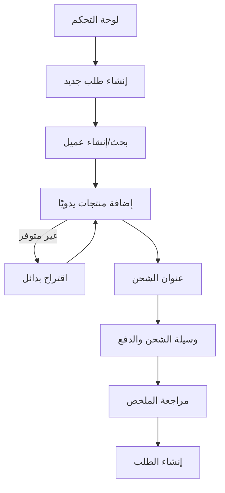
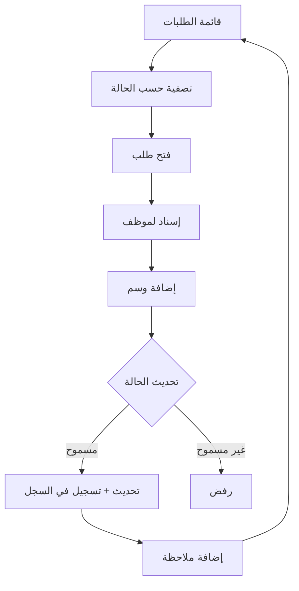
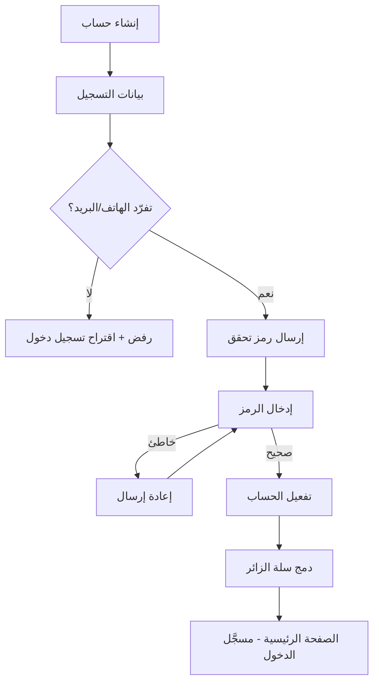
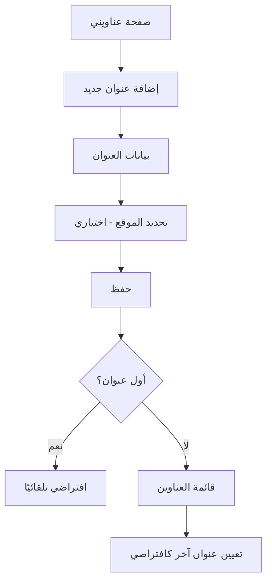
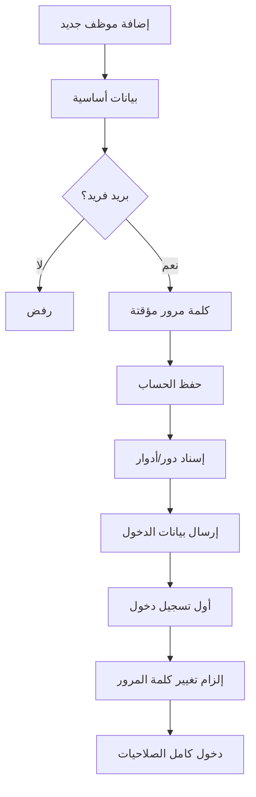
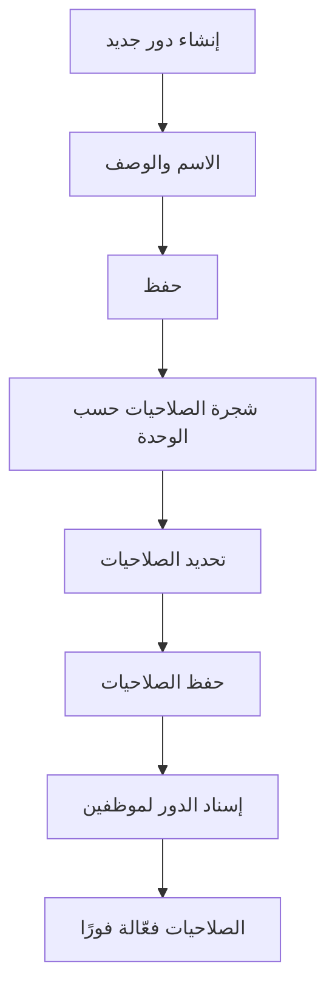

# وثيقة تدفقات المستخدم (User Flows)
## نظام Wow Shopping — الإصدار 1.0
### المجموعة الثالثة والرابعة: تدفقات القسمين 2 و3

> **ملاحظة:** رحلة "إتمام الطلب" الكاملة (UF-01) وما يرتبط بها من دفع وشحن مُغطّاة في مجموعة Cross-Cutting. هنا نُغطّي فقط ما تبقّى من رحلات مركَّبة.

---

# القسم 2 — الإدارة العامة للمبيعات والطلبات

---

## UF-21: إنشاء طلب يدوي من لوحة التحكم نيابة عن عميل

### 1) معلومات التدفق
| البيان | القيمة |
|---|---|
| **رقم التدفق** | UF-21 |
| **اسم التدفق** | إنشاء طلب يدوي من لوحة التحكم |
| **الهدف** | تمكين موظف المبيعات من إنشاء طلب لعميل اتصل هاتفيًا أو طلب حضوريًا |
| **الممثلون المشاركون** | موظف المبيعات (ACT-05) |
| **حالات الاستخدام المرتبطة** | UC-ORD-02, UC-ADDR-07, UC-SHP-07, UC-PM-13 |

### 2) المسار الرئيسي
1. يفتح الموظف "إنشاء طلب جديد" من لوحة التحكم.
2. يبحث عن العميل (بالاسم/الهاتف) أو يُنشئ سجل عميل سريع جديد.
3. يضيف الموظف منتجات/خيارات بيع يدويًا مع الكميات.
4. يحدد عنوان الشحن (موجود أو جديد).
5. يحدد وسيلة الشحن ووسيلة الدفع.
6. يراجع الملخص الكامل.
7. يضغط "إنشاء الطلب".
8. يُنشأ الطلب بنفس منطق الإنشاء العادي (رقم فريد، Snapshot، حالة ابتدائية)، مع تسجيل أن المُنشئ هو موظف وليس العميل.

### 3) الفروع والاستثناءات
| الفرع | نقطة التفرع | الوصف | العودة/الإنهاء |
|---|---|---|---|
| A1 | الخطوة 3 | أحد العناصر غير متوفر | يمنع النظام إضافته، يقترح بدائل |
| A2 | الخطوة 2 | العميل غير موجود في النظام | يُنشئ الموظف سجل عميل مصغَّر (اسم + هاتف) بسرعة دون إتمام تسجيل كامل |

### 4) المخطط البصري المختصر

### 5) جدول الشاشات
| الشاشة | الوظيفة | الحالة |
|---|---|---|
| نموذج إنشاء طلب يدوي | تجميع كل بيانات الطلب في شاشة واحدة | 🆕 |
| نموذج إنشاء عميل سريع | إنشاء سجل عميل مصغَّر أثناء الطلب | 🆕 |

---

## UF-22: متابعة ومعالجة الطلبات اليومية (لوحة عمل الموظف)

### 1) معلومات التدفق
| البيان | القيمة |
|---|---|
| **رقم التدفق** | UF-22 |
| **اسم التدفق** | متابعة ومعالجة الطلبات اليومية |
| **الهدف** | تمكين موظف المبيعات من إدارة قائمة الطلبات اليومية: بحث، إسناد، تحديث حالة، إضافة ملاحظات |
| **الممثلون المشاركون** | موظف المبيعات (ACT-05)، مدير العمليات (ACT-09) |
| **حالات الاستخدام المرتبطة** | UC-ORD-06/07, UC-ORD-03, UC-ORD-11, UC-ORD-08, UC-ORD-12 |

### 2) المسار الرئيسي
1. يفتح الموظف "قائمة الطلبات" ويُصفّي حسب حالة معيّنة (مثلاً: "قيد التجهيز").
2. يفتح طلبًا محددًا.
3. يُسنِد الطلب لنفسه أو لموظف آخر (إن لم يكن مُسنَدًا).
4. يُضيف وسمًا (Tag) مثل "عاجل" إن لزم.
5. يُحدّث حالة الطلب للمرحلة التالية ضمن المسار المسموح.
6. يُضيف ملاحظة داخلية أو موجَّهة للعميل.
7. يعود لقائمة الطلبات لمتابعة الطلب التالي.

### 3) الفروع والاستثناءات
| الفرع | نقطة التفرع | الوصف | العودة/الإنهاء |
|---|---|---|---|
| A1 | الخطوة 5 | محاولة الانتقال لحالة غير مسموحة في المسار | يُرفض التغيير، تظهر فقط الحالات اللاحقة المسموحة |

### 4) المخطط البصري المختصر

### 5) جدول الشاشات
| الشاشة | الوظيفة | الحالة |
|---|---|---|
| قائمة الطلبات مع فلاتر | العمل اليومي الأساسي للموظف | 🆕 |
| صفحة تفاصيل الطلب | الإسناد، الوسوم، الملاحظات، الحالة | ♻️ |

**خاتمة القسم 2:** التدفق الأساسي (إنشاء طلب من السلة والدفع والشحن) مُغطّى بالكامل في UF-01/UF-04/UF-05. هذان التدفقان يُكمِّلان الصورة من منظور العمل الإداري اليومي.

---

# القسم 3 — الإدارة العامة للعملاء والهوية

---

## UF-23: التسجيل والتحقق من الحساب (رحلة عميل جديد كاملة)

### 1) معلومات التدفق
| البيان | القيمة |
|---|---|
| **رقم التدفق** | UF-23 |
| **اسم التدفق** | التسجيل والتحقق من الحساب |
| **الهدف** | تحويل زائر إلى عميل مسجَّل وموثَّق بالكامل |
| **الممثلون المشاركون** | الزائر (ACT-20) → العميل المسجل (ACT-21) |
| **حالات الاستخدام المرتبطة** | UC-CUST-01, UC-CUST-04 |

### 2) المسار الرئيسي
1. يضغط الزائر على "إنشاء حساب".
2. يُدخل الاسم، الهاتف، البريد، كلمة المرور.
3. يتحقق النظام من تفرّد الهاتف/البريد.
4. يضغط "إنشاء الحساب".
5. يُرسل النظام رمز تحقق (OTP) للهاتف/البريد.
6. يُدخل العميل الرمز.
7. يتحقق النظام من صحته، يُفعِّل الحساب بالكامل.
8. يُدمَج سلة الزائر (إن وُجدت) مع الحساب الجديد تلقائيًا.
9. يُوجَّه العميل للصفحة الرئيسية وهو مسجَّل الدخول.

### 3) الفروع والاستثناءات
| الفرع | نقطة التفرع | الوصف | العودة/الإنهاء |
|---|---|---|---|
| A1 | الخطوة 3 | الهاتف/البريد مستخدم مسبقًا | رسالة رفض، يُقترح "تسجيل الدخول" بدلاً من ذلك |
| A2 | الخطوة 6 | رمز خاطئ أو منتهي الصلاحية | رسالة خطأ + زر "إعادة إرسال الرمز" |

### 4) المخطط البصري المختصر

### 5) جدول الشاشات
| الشاشة | الوظيفة | الحالة |
|---|---|---|
| نموذج التسجيل | إدخال البيانات الأساسية | 🆕 |
| نموذج إدخال رمز التحقق (OTP) | التحقق من الهاتف/البريد | 🆕 |

---

## UF-24: إدارة عناوين الشحن المتعددة

### 1) معلومات التدفق
| البيان | القيمة |
|---|---|
| **رقم التدفق** | UF-24 |
| **اسم التدفق** | إدارة عناوين الشحن المتعددة |
| **الهدف** | تمكين العميل من إضافة، تعديل، وتنظيم عدة عناوين شحن |
| **الممثلون المشاركون** | العميل المسجل (ACT-21) |
| **حالات الاستخدام المرتبطة** | UC-ADDR-01, UC-ADDR-02, UC-ADDR-03, UC-ADDR-05, UC-ADDR-06 |

### 2) المسار الرئيسي
1. يفتح العميل صفحة "عناويني".
2. يضغط "إضافة عنوان جديد".
3. يُدخل اسم المستلم، الهاتف، المنطقة، التفاصيل، معلم إضافي.
4. يُحدّد الموقع على الخريطة (اختياري).
5. يحفظ العنوان.
6. إن كان أول عنوان: يُعيَّن تلقائيًا كافتراضي.
7. يُكرِّر العميل لإضافة عناوين أخرى (منزل، عمل...).
8. يُعيِّن العميل عنوانًا مختلفًا كافتراضي عند الحاجة.

### 3) الفروع والاستثناءات
| الفرع | نقطة التفرع | الوصف | العودة/الإنهاء |
|---|---|---|---|
| A1 | الخطوة 3 | حقول إلزامية ناقصة | رفض الحفظ، إبراز الحقول الناقصة |
| A2 | حذف عنوان افتراضي | العميل يحذف العنوان المُعيَّن كافتراضي | يُعيَّن عنوان آخر كافتراضي تلقائيًا إن وُجد |

### 4) المخطط البصري المختصر

### 5) جدول الشاشات
| الشاشة | الوظيفة | الحالة |
|---|---|---|
| صفحة "عناويني" | قائمة كل العناوين | 🆕 |
| نموذج إضافة/تعديل عنوان | البيانات + خريطة اختيارية | 🆕 |

---

## UF-25: تجهيز موظف جديد بالكامل (حساب + دور + أول دخول)

### 1) معلومات التدفق
| البيان | القيمة |
|---|---|
| **رقم التدفق** | UF-25 |
| **اسم التدفق** | تجهيز موظف جديد بالكامل |
| **الهدف** | إنشاء حساب موظف، إسناد دور، وتأمين أول تسجيل دخول له |
| **الممثلون المشاركون** | مدير النظام (ACT-15)، الموظف الجديد |
| **حالات الاستخدام المرتبطة** | UC-STAFF-01, UC-STAFF-08, UC-STAFF-05, UC-STAFF-06 |

### 2) المسار الرئيسي
1. يفتح مدير النظام "إضافة موظف جديد".
2. يُدخل الاسم، البريد، الهاتف، المسمى الوظيفي.
3. يُعيِّن كلمة مرور مؤقتة.
4. يحفظ الحساب.
5. يفتح قسم "الأدوار" ويُسنِد دورًا واحدًا أو أكثر (مثل "موظف مبيعات").
6. يُرسَل للموظف الجديد بريد/رسالة ببيانات الدخول المؤقتة.
7. يسجّل الموظف الجديد الدخول لأول مرة.
8. يُلزَم النظام الموظف بتغيير كلمة المرور فورًا.
9. يُدخل الموظف كلمة مرور جديدة، يدخل للوحة التحكم بصلاحياته الكاملة.

### 3) الفروع والاستثناءات
| الفرع | نقطة التفرع | الوصف | العودة/الإنهاء |
|---|---|---|---|
| A1 | الخطوة 2 | البريد مستخدم من موظف آخر | رفض الحفظ |
| A2 | الخطوة 8 | كلمة المرور الجديدة لا تستوفي معايير الأمان | رفض مع عرض المتطلبات |

### 4) المخطط البصري المختصر

### 5) جدول الشاشات
| الشاشة | الوظيفة | الحالة |
|---|---|---|
| نموذج إنشاء موظف | البيانات الأساسية | 🆕 |
| قسم إسناد الأدوار | اختيار دور/أدوار للموظف | ♻️ (من إدارة الأدوار) |
| نموذج تسجيل دخول الموظف | دخول لوحة التحكم | 🆕 |
| نموذج تغيير كلمة المرور الإلزامي | يظهر عند أول دخول فقط | 🆕 |

---

## UF-26: إنشاء دور جديد وإسناد صلاحياته

### 1) معلومات التدفق
| البيان | القيمة |
|---|---|
| **رقم التدفق** | UF-26 |
| **اسم التدفق** | إنشاء دور جديد وإسناد صلاحياته |
| **الهدف** | بناء دور وظيفي جديد بصلاحيات دقيقة قابل لإسناده لأي عدد من الموظفين |
| **الممثلون المشاركون** | مسؤولو الأمن والصلاحيات (ACT-16) |
| **حالات الاستخدام المرتبطة** | UC-ROLE-01, UC-ROLE-04, UC-ROLE-05 |

### 2) المسار الرئيسي
1. يفتح المستخدم "إنشاء دور جديد".
2. يُدخل الاسم والوصف.
3. يحفظ الدور.
4. يفتح قسم "الصلاحيات" المصنَّف حسب الوحدات الإدارية (منتجات، طلبات، مالية...).
5. يُحدّد الصلاحيات المطلوبة (عرض/إنشاء/تعديل/حذف/اعتماد) لكل وحدة.
6. يحفظ الصلاحيات.
7. يفتح قسم "المستخدمون المرتبطون" ويُسنِد الدور لموظف/موظفين.
8. تصبح الصلاحيات فعّالة فورًا لكل المستخدمين المرتبطين.

### 3) الفروع والاستثناءات
| الفرع | نقطة التفرع | الوصف | العودة/الإنهاء |
|---|---|---|---|
| A1 | الخطوة 2 | اسم مكرر | رفض الحفظ |
| A2 | محاولة تعديل دور Super Admin | ممنوع إلا بسياسة خاصة | رفض العملية |

### 4) المخطط البصري المختصر

### 5) جدول الشاشات
| الشاشة | الوظيفة | الحالة |
|---|---|---|
| نموذج إنشاء دور | الاسم والوصف | 🆕 |
| شجرة/جدول الصلاحيات | تحديد الصلاحيات حسب الوحدة | 🆕 |
| قسم المستخدمين المرتبطين | ربط الدور بموظفين | 🆕 |

