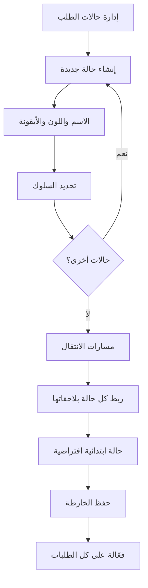
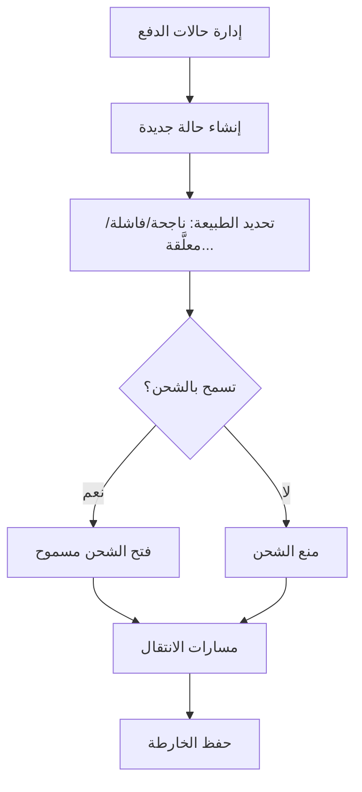
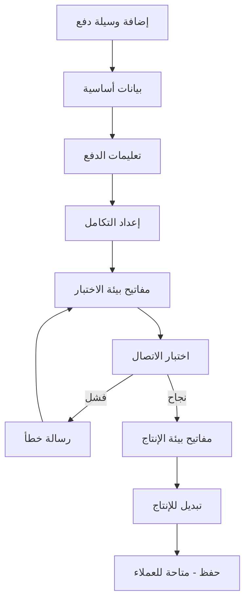
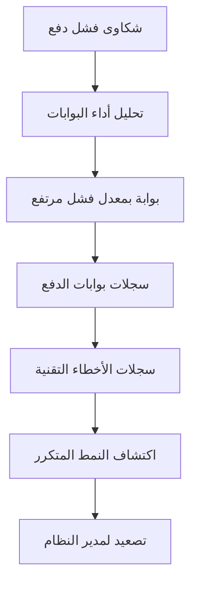
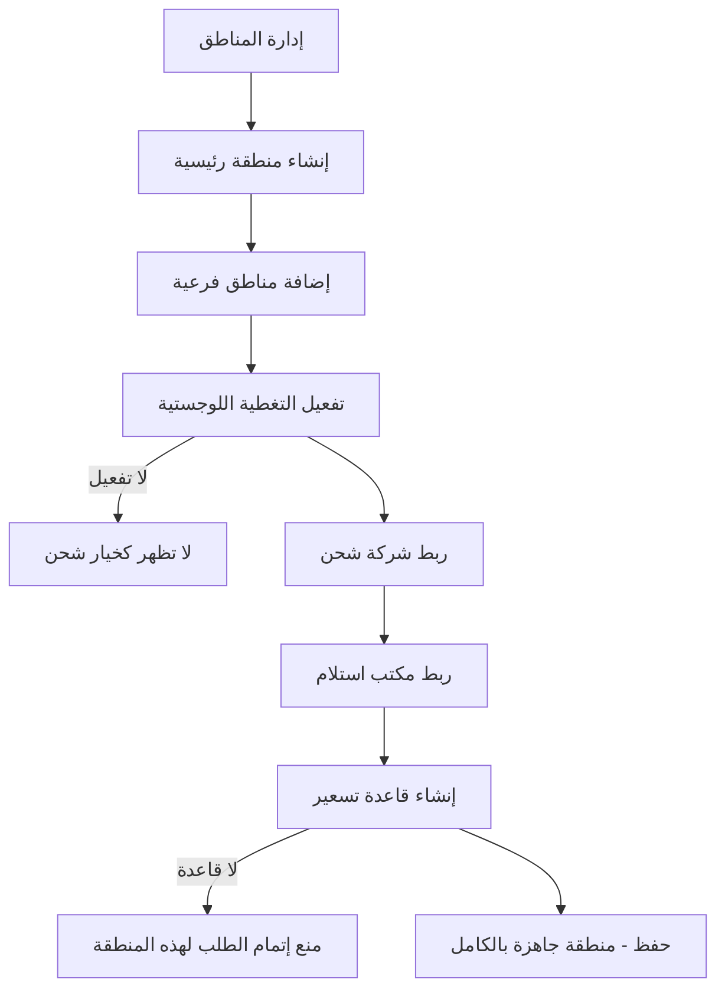
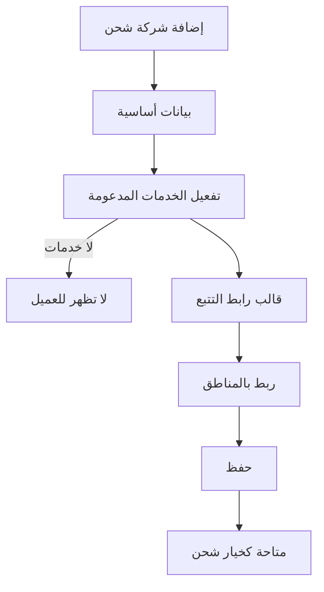

# وثيقة تدفقات المستخدم (User Flows)
## نظام Wow Shopping — الإصدار 1.0
### المجموعة الخامسة والسادسة والسابعة: تدفقات الأقسام 4، 5، 6

---

# القسم 4 — الإدارة العامة للمسارات والحالات

---

## UF-27: بناء محرك حالات الطلب الكامل (خارطة انتقال State Machine)

### 1) معلومات التدفق
| البيان | القيمة |
|---|---|
| **رقم التدفق** | UF-27 |
| **اسم التدفق** | بناء محرك حالات الطلب الكامل |
| **الهدف** | تصميم كل حالات الطلب الممكنة وربطها بمسارات انتقال منطقية وسلوك تلقائي |
| **الممثلون المشاركون** | مدير العمليات (ACT-09) |
| **حالات الاستخدام المرتبطة** | UC-OST-01, UC-OST-04, UC-OST-05 |

### 2) المسار الرئيسي
1. يفتح مدير العمليات "إدارة حالات الطلب".
2. يُنشئ حالة جديدة (مثال: "قيد التجهيز") بالاسم واللون والأيقونة.
3. يُحدّد سلوكها: هل نهائية؟ ملغاة؟ تتطلب إشعارًا؟ تؤثر على المخزون؟
4. يُكرِّر الخطوتين 2-3 لكل حالة مطلوبة (جديد، مؤكَّد، قيد التجهيز، تم الشحن، تم التسليم، ملغى...).
5. يفتح "مسارات الانتقال" ويربط كل حالة بالحالات اللاحقة المسموح الانتقال إليها منها.
6. يُعيِّن حالة ابتدائية افتراضية للطلبات الجديدة.
7. يحفظ الخارطة الكاملة.
8. تصبح خارطة الحالات فعّالة فورًا على كل الطلبات الجديدة والمُحدَّثة.

### 3) الفروع والاستثناءات
| الفرع | نقطة التفرع | الوصف | العودة/الإنهاء |
|---|---|---|---|
| A1 | الخطوة 2 | اسم حالة مكرر | رفض الحفظ |
| A2 | محاولة حذف حالة مستخدمة في طلبات سابقة | يُمنع الحذف، يُتاح "تعطيل" فقط |

### 4) المخطط البصري المختصر

### 5) جدول الشاشات
| الشاشة | الوظيفة | الحالة |
|---|---|---|
| شاشة إدارة حالات الطلب | قائمة وإنشاء الحالات | 🆕 |
| محرر مسارات الانتقال | ربط الحالات ببعضها (مصفوفة/رسم) | 🆕 |

---

## UF-28: بناء محرك حالات الدفع الكامل

### 1) معلومات التدفق
| البيان | القيمة |
|---|---|
| **رقم التدفق** | UF-28 |
| **اسم التدفق** | بناء محرك حالات الدفع الكامل |
| **الهدف** | تصميم حالات الدفع (ناجحة/فاشلة/معلَّقة/مراجعة/مستردة) وربطها بأثرها على الشحن |
| **الممثلون المشاركون** | الإدارة المالية (ACT-07) |
| **حالات الاستخدام المرتبطة** | UC-PST-01, UC-PST-04, UC-PST-05 |

### 2) المسار الرئيسي
1. يفتح المستخدم "إدارة حالات الدفع".
2. يُنشئ حالة جديدة (مثال: "قيد المراجعة المالية").
3. يُحدّد طبيعتها: ناجحة/فاشلة/معلَّقة/تتطلب مراجعة/مستردة جزئيًا أو كليًا.
4. يُحدّد هل تسمح بالشحن أم تمنعه.
5. يُكرِّر لكل حالة مطلوبة.
6. يربط مسارات الانتقال بين حالات الدفع.
7. يحفظ الخارطة.

### 3) الفروع والاستثناءات
| الفرع | نقطة التفرع | الوصف | العودة/الإنهاء |
|---|---|---|---|
| A1 | الخطوة 4 | تعيين حالة "لا تسمح بالشحن" | أي طلب بهذه الحالة يُمنع من فتح مرحلة الشحن تلقائيًا |

### 4) المخطط البصري المختصر

### 5) جدول الشاشات
| الشاشة | الوظيفة | الحالة |
|---|---|---|
| شاشة إدارة حالات الدفع | قائمة وإنشاء الحالات | 🆕 |
| محرر مسارات انتقال الدفع | ربط حالات الدفع ببعضها | 🆕 |

---

# القسم 5 — الإدارة المالية

---

## UF-29: إعداد وسيلة دفع مع تكامل بوابة إلكترونية

### 1) معلومات التدفق
| البيان | القيمة |
|---|---|
| **رقم التدفق** | UF-29 |
| **اسم التدفق** | إعداد وسيلة دفع مع تكامل بوابة إلكترونية |
| **الهدف** | إضافة وسيلة دفع جديدة وربطها فعليًا ببوابة دفع خارجية عبر API |
| **الممثلون المشاركون** | الإدارة المالية (ACT-07)، مدير النظام (ACT-15)، بوابة الدفع (ACT-22) |
| **حالات الاستخدام المرتبطة** | UC-PM-01, UC-PM-05, UC-PM-09, UC-PM-10 |

### 2) المسار الرئيسي
1. يفتح المستخدم "إضافة وسيلة دفع جديدة".
2. يُدخل الاسم، الوصف، الشعار.
3. يفتح قسم "تعليمات الدفع" ويكتب التعليمات (متعددة اللغات إن لزم).
4. يفتح قسم "التكامل مع بوابة الدفع".
5. يختار نوع التكامل (API/Redirect/Embedded).
6. يُدخل مفاتيح API لبيئة الاختبار أولاً.
7. يضغط "اختبار الاتصال".
8. عند النجاح: يُدخل مفاتيح بيئة الإنتاج، ويُبدِّل الوضع للإنتاج.
9. يحفظ الوسيلة، تصبح متاحة فورًا للعملاء.

### 3) الفروع والاستثناءات
| الفرع | نقطة التفرع | الوصف | العودة/الإنهاء |
|---|---|---|---|
| A1 | الخطوة 7 | فشل اختبار الاتصال | تُعرض رسالة الخطأ التفصيلية من البوابة، يبقى المستخدم لتصحيح البيانات |
| A2 | أي خطوة | محاولة استخدام مفاتيح إنتاج في وضع اختبار | يُمنع النظام ذلك تمامًا |

### 4) المخطط البصري المختصر

### 5) جدول الشاشات
| الشاشة | الوظيفة | الحالة |
|---|---|---|
| نموذج إنشاء وسيلة دفع | متعدد الأقسام (أساسي/تعليمات/تكامل) | 🆕 |
| قسم اختبار الاتصال | زر اختبار + عرض النتيجة | 🆕 |

---

## UF-30: مراجعة أداء بوابات الدفع وتحليل الأعطال

### 1) معلومات التدفق
| البيان | القيمة |
|---|---|
| **رقم التدفق** | UF-30 |
| **اسم التدفق** | مراجعة أداء بوابات الدفع وتحليل الأعطال |
| **الهدف** | تمكين الفريق المالي من اكتشاف مشاكل بوابة دفع معيّنة عبر السجلات والتحليلات |
| **الممثلون المشاركون** | المحقق المالي (ACT-07)، مدير النظام (ACT-15) |
| **حالات الاستخدام المرتبطة** | UC-GLG-01, UC-GLG-03, UC-GLG-04, UC-GLG-07 |

### 2) المسار الرئيسي
1. يلاحظ المحقق المالي شكاوى متكررة حول فشل الدفع.
2. يفتح شاشة "تحليل أداء البوابات".
3. يرى معدل الفشل المرتفع لبوابة معيّنة.
4. يفتح "سجلات بوابات الدفع" ويُصفّي حسب هذه البوابة والفترة الزمنية.
5. يفتح سجلات الأخطاء التقنية المصنَّفة (مهلة/توقيع/اتصال).
6. يكتشف نمط الخطأ المتكرر (مثلاً: انتهاء مهلة الاتصال).
7. يُصعِّد الأمر لمدير النظام لمراجعة إعدادات التكامل.

### 3) الفروع والاستثناءات
| الفرع | نقطة التفرع | الوصف | العودة/الإنهاء |
|---|---|---|---|
| A1 | الخطوة 4 | لا سجلات كافية للفترة | رسالة توضيحية، يُقترح توسيع النطاق الزمني |

### 4) المخطط البصري المختصر

### 5) جدول الشاشات
| الشاشة | الوظيفة | الحالة |
|---|---|---|
| لوحة تحليل أداء البوابات | مقارنة البوابات ومعدلات النجاح/الفشل | 🆕 |
| شاشة سجلات بوابات الدفع | بحث وتصفية تفصيلية | 🆕 |

---

# القسم 6 — الإدارة العامة للشحن واللوجستيات

---

## UF-31: بناء التغطية اللوجستية الكاملة لمنطقة جديدة

### 1) معلومات التدفق
| البيان | القيمة |
|---|---|
| **رقم التدفق** | UF-31 |
| **اسم التدفق** | بناء التغطية اللوجستية الكاملة لمنطقة جديدة |
| **الهدف** | تجهيز منطقة جديدة بالكامل (هيكل + تغطية + شركات + تسعير) لتصبح قابلة للطلب فعليًا |
| **الممثلون المشاركون** | مدير العمليات (ACT-09) |
| **حالات الاستخدام المرتبطة** | UC-ZON-01/02/05, UC-CAR-06, UC-SHP-01, UC-PUP-04 |

### 2) المسار الرئيسي
1. يفتح مدير العمليات "إدارة المناطق" وينشئ منطقة رئيسية جديدة (مثال: محافظة جديدة).
2. يُضيف مناطق فرعية تحتها (مدن/أحياء).
3. يفتح قسم "التغطية اللوجستية" ويُفعِّل التوصيل المنزلي والاستلام من مكتب.
4. ينتقل لـ"شركات الشحن" ويربط شركة موجودة بهذه المنطقة الجديدة.
5. ينتقل لـ"مكاتب الاستلام" ويربط مكتبًا موجودًا (أو ينشئ جديدًا) بهذه المنطقة.
6. ينتقل لـ"تسعير الشحن" وينشئ قاعدة تسعير جديدة لهذه المنطقة (تكلفة أساسية، وقت توصيل مقدَّر).
7. يحفظ كل الإعدادات.
8. تصبح المنطقة متاحة فورًا كخيار شحن كامل عند إتمام أي طلب.

### 3) الفروع والاستثناءات
| الفرع | نقطة التفرع | الوصف | العودة/الإنهاء |
|---|---|---|---|
| A1 | الخطوة 3 | عدم تفعيل أي تغطية | المنطقة تُحفظ لكن لا تظهر كخيار شحن للعميل |
| A2 | الخطوة 6 | عدم إنشاء قاعدة تسعير | الطلب لهذه المنطقة يُمنع من الإتمام حتى تُضاف قاعدة صالحة |

### 4) المخطط البصري المختصر

### 5) جدول الشاشات
| الشاشة | الوظيفة | الحالة |
|---|---|---|
| شاشة إدارة المناطق (شجرة) | إنشاء الهيكل الجغرافي | 🆕 |
| قسم التغطية اللوجستية | تفعيل أنواع الخدمة للمنطقة | 🆕 |
| شاشة إدارة شركات الشحن (ربط) | ربط شركة بالمنطقة الجديدة | ♻️ |
| شاشة إدارة مكاتب الاستلام (ربط) | ربط مكتب بالمنطقة الجديدة | ♻️ |
| نموذج إنشاء قاعدة تسعير | تكلفة ووقت توصيل للمنطقة | 🆕 |

---

## UF-32: تجهيز شركة شحن جديدة بالكامل (بيانات + خدمات + تتبع)

### 1) معلومات التدفق
| البيان | القيمة |
|---|---|
| **رقم التدفق** | UF-32 |
| **اسم التدفق** | تجهيز شركة شحن جديدة بالكامل |
| **الهدف** | إضافة شركة شحن وتفعيل خدماتها وقالب التتبع الخاص بها |
| **الممثلون المشاركون** | مدير العمليات (ACT-09) |
| **حالات الاستخدام المرتبطة** | UC-CAR-01, UC-CAR-04, UC-CAR-05, UC-CAR-06 |

### 2) المسار الرئيسي
1. يفتح المستخدم "إضافة شركة شحن جديدة".
2. يُدخل الاسم، الكود الداخلي، الشعار.
3. يفتح قسم "الخدمات" ويُفعِّل الخدمات التي تدعمها الشركة فعليًا (توصيل منزلي/استلام مكتب/شحن سريع).
4. يفتح قسم "بيانات التتبع" ويُدخل قالب رابط التتبع.
5. يفتح قسم "التغطية الجغرافية" ويربط الشركة بالمناطق التي تخدمها.
6. يحفظ الشركة.
7. تصبح الشركة متاحة فورًا كخيار شحن للمناطق والخدمات المرتبطة بها.

### 3) الفروع والاستثناءات
| الفرع | نقطة التفرع | الوصف | العودة/الإنهاء |
|---|---|---|---|
| A1 | الخطوة 3 | عدم تفعيل أي خدمة | الشركة لا تظهر في أي خيار شحن للعميل |

### 4) المخطط البصري المختصر

### 5) جدول الشاشات
| الشاشة | الوظيفة | الحالة |
|---|---|---|
| نموذج إنشاء شركة شحن | البيانات الأساسية والخدمات والتتبع | 🆕 |

---

## خاتمة المجموعات 5-6-7

اكتملت تدفقات الأقسام 4، 5، 6 (UF-27 إلى UF-32)، مركِّزة على الرحلات التأسيسية (بناء محرك الحالات، إعداد وسائل الدفع والتكامل، بناء التغطية اللوجستية). الحالات الفردية الأبسط (تعديل/بحث/تصفية) لا تحتاج تدفقًا مستقلاً.

