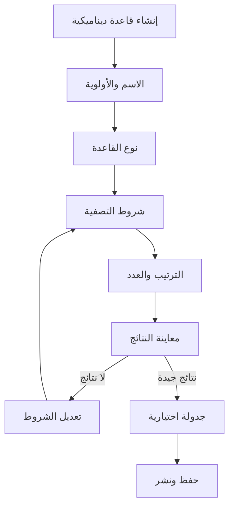
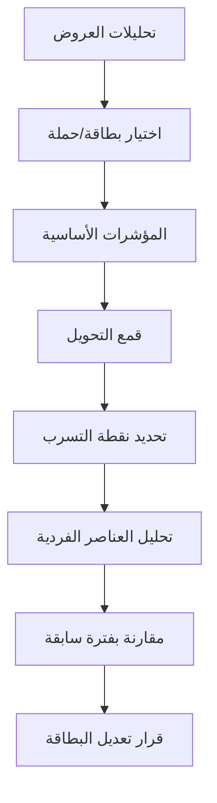
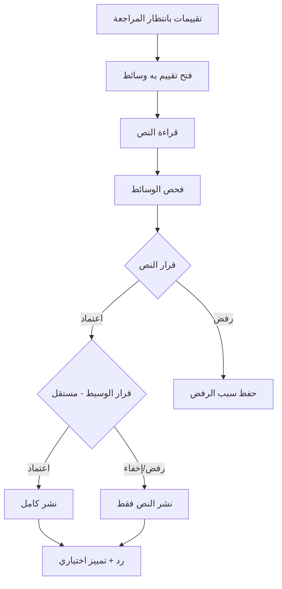
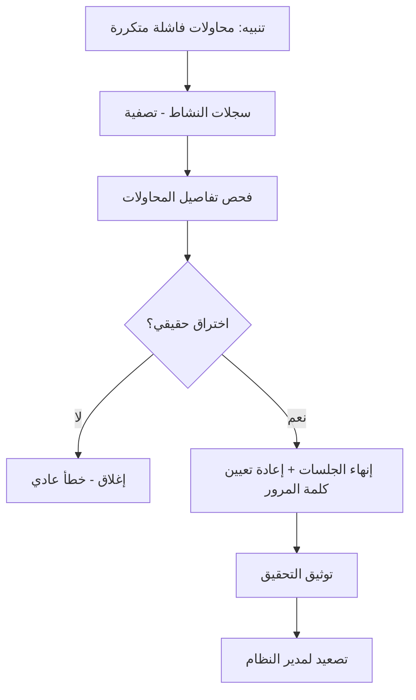
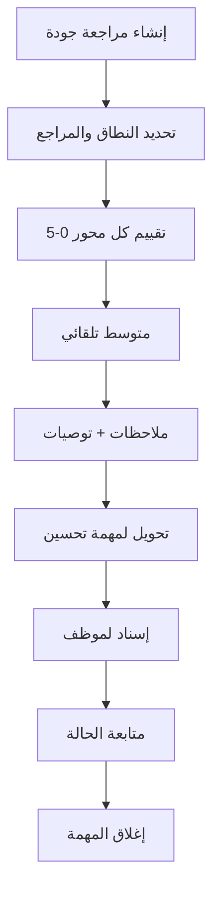
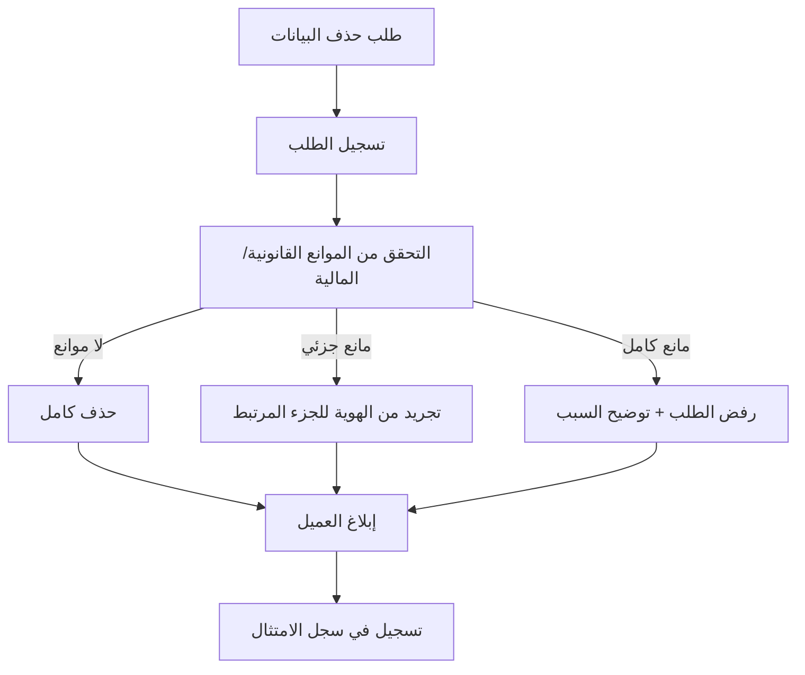

# وثيقة تدفقات المستخدم (User Flows)
## نظام Wow Shopping — الإصدار 1.0
### المجموعة الثامنة والتاسعة والعاشرة: تدفقات الأقسام 7، 8، 9 (الأخيرة)

> **ملاحظة:** تدفق "بناء واجهة تسويقية مركّبة" (بطاقة + مجموعة + قاعدة ديناميكية) مُغطّى بالكامل في UF-13 ضمن مجموعة Cross-Cutting. هنا نُغطّي ما تبقّى من رحلات القسم السابع، إضافة لأقسام الجودة والرقابة.

---

# القسم 7 — الإدارة العامة للتسويق والمحتوى

---

## UF-33: بناء قاعدة ديناميكية واختبارها قبل النشر

### 1) معلومات التدفق
| البيان | القيمة |
|---|---|
| **رقم التدفق** | UF-33 |
| **اسم التدفق** | بناء قاعدة ديناميكية واختبارها قبل النشر |
| **الهدف** | تصميم قاعدة تُولِّد محتوى تلقائيًا (الأكثر مبيعًا مثلاً) مع معاينة آمنة قبل التفعيل |
| **الممثلون المشاركون** | مدير التسويق (ACT-12) |
| **حالات الاستخدام المرتبطة** | UC-DYN-01, UC-DYN-03, UC-DYN-04, UC-DYN-05, UC-DYN-06, UC-DYN-08 |

### 2) المسار الرئيسي
1. يفتح مدير التسويق "إنشاء قاعدة ديناميكية جديدة".
2. يُدخل الاسم والأولوية.
3. يختار نوع القاعدة (مثال: "الأكثر مبيعًا").
4. يُحدّد شروط تصفية إضافية (فئة معيّنة، نطاق سعري).
5. يُحدّد طريقة الترتيب وعدد المنتجات المسترجعة.
6. يضغط "معاينة النتائج".
7. يراجع القائمة الناتجة فعليًا؛ إن استُبعد منتج متوقَّع يفحص السبب.
8. يُعدِّل الشروط عند الحاجة ويُعيد المعاينة.
9. يُحدّد جدولة تشغيل القاعدة (اختياري).
10. يحفظ وينشر القاعدة.

### 3) الفروع والاستثناءات
| الفرع | نقطة التفرع | الوصف | العودة/الإنهاء |
|---|---|---|---|
| A1 | الخطوة 7 | القاعدة لا تُنتج نتائج (شروط ضيقة جدًا) | رسالة توضيحية، اقتراح تخفيف الشروط، العودة للخطوة 4 |

### 4) المخطط البصري المختصر

### 5) جدول الشاشات
| الشاشة | الوظيفة | الحالة |
|---|---|---|
| نموذج إنشاء قاعدة ديناميكية | كل إعدادات القاعدة | 🆕 |
| شاشة معاينة النتائج | عرض حي قبل النشر مع تشخيص الاستبعاد | 🆕 |

---

## UF-34: تحليل أداء حملة تسويقية ومتابعة قمع التحويل

### 1) معلومات التدفق
| البيان | القيمة |
|---|---|
| **رقم التدفق** | UF-34 |
| **اسم التدفق** | تحليل أداء حملة تسويقية |
| **الهدف** | تمكين مدير التسويق من فهم أداء بطاقة/حملة من الظهور وحتى الشراء الفعلي |
| **الممثلون المشاركون** | مدير التسويق (ACT-12) |
| **حالات الاستخدام المرتبطة** | UC-ANA-04, UC-ANA-05, UC-ANA-08, UC-ANA-09, UC-ANA-11 |

### 2) المسار الرئيسي
1. يفتح مدير التسويق "تحليلات العروض".
2. يختار بطاقة/حملة محددة.
3. يرى المؤشرات الأساسية (CTR، معدل التحويل، الإيراد).
4. يفتح "قمع التحويل" ليرى: ظهور → نقرة → إضافة للسلة → شراء.
5. يلاحظ نقطة تسرب كبيرة (مثلاً بين النقرة والإضافة للسلة).
6. يفتح "تحليل العناصر الفردية" داخل البطاقة ليعرف أي منتج يُضعف الأداء.
7. يقارن الأداء مع فترة سابقة.
8. يقرر تعديل البطاقة (استبدال العنصر الضعيف) بناءً على البيانات.

### 3) الفروع والاستثناءات
| الفرع | نقطة التفرع | الوصف | العودة/الإنهاء |
|---|---|---|---|
| A1 | الخطوة 3 | بيانات غير كافية بعد | تُعرض قيم صفرية أو رسالة "لا توجد بيانات كافية" |

### 4) المخطط البصري المختصر

### 5) جدول الشاشات
| الشاشة | الوظيفة | الحالة |
|---|---|---|
| لوحة تحليلات العروض | مؤشرات + قمع تحويل + مقارنة | 🆕 |
| شاشة تحليل العناصر الفردية | أداء كل منتج داخل البطاقة | 🆕 |

---

# القسم 8 — الإدارة العامة للجودة وخدمة العملاء

> **ملاحظة:** تدفقات "إضافة تقييم" (UF-07)، "تقديم شكوى" (UF-08)، و"بلاغ إساءة" (UF-09) مُغطّاة بالكامل في مجموعة Cross-Cutting. هنا نُغطّي التدفق الإداري المتبقي الخاص بمراجعة الوسائط المرفقة.

---

## UF-35: مراجعة تقييم ووسائطه معًا (سير عمل موظف الإشراف)

### 1) معلومات التدفق
| البيان | القيمة |
|---|---|
| **رقم التدفق** | UF-35 |
| **اسم التدفق** | مراجعة تقييم ووسائطه معًا |
| **الهدف** | تمكين موظف الإشراف من مراجعة نص التقييم والوسائط المرفقة به في سير عمل واحد متكامل |
| **الممثلون المشاركون** | موظف المراجعة والإشراف (ACT-14) |
| **حالات الاستخدام المرتبطة** | UC-REV-03, UC-RMW-02, UC-REV-04, UC-REV-05 |

### 2) المسار الرئيسي
1. يفتح الموظف "تقييمات بانتظار المراجعة".
2. يفتح تقييمًا يحتوي وسائط مرفقة.
3. يقرأ نص التقييم ودرجته.
4. يفحص الصور/الفيديو المرفق بشكل منفصل.
5. يُقرِّر بشأن النص: اعتماد أو رفض.
6. يُقرِّر بشأن الوسائط بشكل مستقل: اعتماد أو رفض أو إخفاء (حتى لو كان النص سليمًا والوسيط مخالفًا أو العكس).
7. عند اعتماد التقييم: يمكنه الرد عليه رسميًا، أو تمييزه كمفيد.
8. ينتقل للتقييم التالي في القائمة.

### 3) الفروع والاستثناءات
| الفرع | نقطة التفرع | الوصف | العودة/الإنهاء |
|---|---|---|---|
| A1 | الخطوة 6 | الوسيط مخالف لكن النص سليم | يُحذف/يُخفى الوسيط فقط دون التأثير على التقييم النصي المعتمد |
| A2 | الخطوة 5 | النص يحتاج توضيحًا إضافيًا | يختار "إعادة للمراجعة" بدل القرار النهائي |

### 4) المخطط البصري المختصر

### 5) جدول الشاشات
| الشاشة | الوظيفة | الحالة |
|---|---|---|
| شاشة مراجعة التقييمات (موحَّدة مع الوسائط) | قرار مستقل للنص والوسيط في نفس الشاشة | 🆕 |

---

## UF-36: مراجعة تقارير الجودة الداخلية واتخاذ قرارات تحسين

### 1) معلومات التدفق
| البيان | القيمة |
|---|---|
| **رقم التدفق** | UF-36 |
| **اسم التدفق** | مراجعة تقارير الجودة الداخلية |
| **الهدف** | ربط سيتوثيق هذا التدفق ضمن القسم 9 لتفادي التكرار (انظر UF-38) | — |

> **ملاحظة:** هذا التدفق نُقل للقسم 9 (مراجعات الجودة الداخلية تنتمي فعليًا لوحدة 9.2 حسب وثيقة المتطلبات، رغم أن اسم "الجودة" يظهر أيضًا في القسم 8 لخدمة العملاء). انظر **UF-38** أدناه.

---

# القسم 9 — الإدارة العامة للرقابة والتدقيق

---

## UF-37: التحقيق في نمط نشاط مشبوه عبر سجلات النظام

### 1) معلومات التدفق
| البيان | القيمة |
|---|---|
| **رقم التدفق** | UF-37 |
| **اسم التدفق** | التحقيق في نمط نشاط مشبوه |
| **الهدف** | تمكين مسؤول الأمن من اكتشاف والتحقيق في محاولات دخول فاشلة متكررة أو نشاط غير طبيعي |
| **الممثلون المشاركون** | مسؤولو الأمن والصلاحيات (ACT-16)، المدقق الداخلي (ACT-17) |
| **حالات الاستخدام المرتبطة** | UC-LOG-04, UC-LOG-07, UC-LOG-05, UC-STAFF-07 |

### 2) المسار الرئيسي
1. يستقبل مسؤول الأمن تنبيهًا آليًا (محاولات دخول فاشلة متكررة من نفس IP/مستخدم).
2. يفتح "سجلات النشاط" ويُصفّي حسب المستخدم/IP والفترة الزمنية.
3. يفحص تفاصيل كل محاولة (الوقت، الجهاز، النتيجة).
4. يُحدّد إن كانت محاولة اختراق حقيقية أو خطأ عادي من الموظف.
5. عند الاشتباه الجدي: يُنهي جلسات الموظف النشطة، ويُعيد تعيين كلمة مروره فورًا.
6. يُوثِّق التحقيق كملاحظة داخلية.
7. يُصعِّد لمدير النظام إن استدعى الأمر إجراءً أعمق.

### 3) الفروع والاستثناءات
| الفرع | نقطة التفرع | الوصف | العودة/الإنهاء |
|---|---|---|---|
| A1 | الخطوة 4 | تبيّن أنه خطأ عادي (نسيان كلمة المرور) | يُغلق التحقيق دون إجراء أمني، يُقترح للموظف "استعادة كلمة المرور" |

### 4) المخطط البصري المختصر

### 5) جدول الشاشات
| الشاشة | الوظيفة | الحالة |
|---|---|---|
| شاشة سجلات النشاط | نفس شاشة UF-10 | ♻️ |
| شاشة إدارة الموظفين (إجراء أمني) | إنهاء جلسات + إعادة تعيين كلمة مرور | ♻️ |

---

## UF-38: دورة مراجعة جودة كاملة (من الإنشاء إلى مهمة التحسين)

### 1) معلومات التدفق
| البيان | القيمة |
|---|---|
| **رقم التدفق** | UF-38 |
| **اسم التدفق** | دورة مراجعة جودة كاملة |
| **الهدف** | تحويل مراجعة جودة من تقرير ساكن إلى مهمة تحسين فعلية قابلة للتتبع حتى الإغلاق |
| **الممثلون المشاركون** | موظف الجودة (ACT-13) |
| **حالات الاستخدام المرتبطة** | UC-AUD-01, UC-AUD-02, UC-AUD-03, UC-AUD-04 |

### 2) المسار الرئيسي
1. يفتح موظف الجودة "إنشاء مراجعة جودة جديدة".
2. يحدد نطاقها (مثال: "دقة وصف منتج X") والمراجع المسؤول.
3. يُقيِّم كل محور بدرجة من 0 إلى 5 (المنتج، الوصف، الصور، الشحن، الخدمة).
4. يحسب النظام المتوسط الكلي تلقائيًا.
5. يكتب موظف الجودة ملاحظات تفصيلية.
6. يُضيف توصية تحسين ("تحديث صور المنتج بجودة أعلى").
7. يضغط "تحويل إلى مهمة تحسين".
8. يُسنِد المهمة لموظف المنتجات المسؤول.
9. يتابع موظف الجودة حالة المهمة (جديدة → قيد التنفيذ → مكتملة).
10. عند الاكتمال: يُغلق المهمة، ترتبط بالمراجعة الأصلية في السجل.

### 3) الفروع والاستثناءات
| الفرع | نقطة التفرع | الوصف | العودة/الإنهاء |
|---|---|---|---|
| A1 | الخطوة 3 | بعض المحاور غير ذات صلة بنوع المراجعة | يُكتفى بتقييم المحاور المطابقة فقط |

### 4) المخطط البصري المختصر

### 5) جدول الشاشات
| الشاشة | الوظيفة | الحالة |
|---|---|---|
| نموذج إنشاء مراجعة جودة | النطاق والمراجع | 🆕 |
| نموذج التقييم بالمحاور | درجات + ملاحظات + توصيات | 🆕 |
| شاشة مهام التحسين | إسناد ومتابعة حتى الإغلاق | 🆕 |

---

## UF-39: معالجة طلب خصوصية عميل (حذف/تجريد بيانات)

### 1) معلومات التدفق
| البيان | القيمة |
|---|---|
| **رقم التدفق** | UF-39 |
| **اسم التدفق** | معالجة طلب خصوصية عميل |
| **الهدف** | معالجة طلب العميل لحذف بياناته مع احترام أي التزامات قانونية/مالية |
| **الممثلون المشاركون** | العميل المسجل (ACT-21)، الفريق القانوني/مسؤول الامتثال (ACT-18) |
| **حالات الاستخدام المرتبطة** | UC-RET-04, UC-RET-06, UC-RET-05 |

### 2) المسار الرئيسي
1. يضغط العميل على "طلب حذف بياناتي" من إعدادات الخصوصية.
2. يُسجّل النظام الطلب برقم مرجعي.
3. يفتح مسؤول الامتثال الطلب.
4. يتحقق النظام تلقائيًا من وجود التزامات مالية/قانونية (فواتير، نزاعات).
5. لا موانع: يُنفَّذ حذف كامل للبيانات الشخصية.
6. يوجد مانع جزئي (فواتير): تُحوَّل البيانات المرتبطة بها لصيغة مجهولة الهوية بدل الحذف الكامل.
7. يُبلَّغ العميل بنتيجة الطلب (منفَّذ بالكامل/جزئيًا مع التوضيح).
8. يُسجَّل الإجراء بالكامل في سجل الامتثال.

### 3) الفروع والاستثناءات
| الفرع | نقطة التفرع | الوصف | العودة/الإنهاء |
|---|---|---|---|
| A1 | الخطوة 4 | مانع قانوني كامل يمنع أي حذف | يُرفض الطلب بالكامل مع توضيح السبب للعميل |

### 4) المخطط البصري المختصر

### 5) جدول الشاشات
| الشاشة | الوظيفة | الحالة |
|---|---|---|
| نموذج طلب خصوصية (للعميل) | تقديم طلب حذف/وصول/تصحيح | 🆕 |
| شاشة معالجة طلبات الخصوصية (إدارية) | فحص الموانع واتخاذ القرار | 🆕 |

---

## الخاتمة النهائية لوثيقة User Flows

بهذا تكتمل **وثيقة تدفقات المستخدم (User Flows)** بكامل مجموعاتها العشر:

| المجموعة | النطاق | عدد التدفقات |
|---|---|---|
| الأولى | الحالات المتداخلة (Cross-Cutting) | UF-01 إلى UF-15 (15) |
| الثانية | القسم 1: المنتجات والمخزون | UF-16 إلى UF-20 (5) |
| الثالثة | القسم 2: المبيعات والطلبات | UF-21 إلى UF-22 (2) |
| الرابعة | القسم 3: العملاء والهوية | UF-23 إلى UF-26 (4) |
| الخامسة | القسم 4: المسارات والحالات | UF-27 إلى UF-28 (2) |
| السادسة | القسم 5: الإدارة المالية | UF-29 إلى UF-30 (2) |
| السابعة | القسم 6: الشحن واللوجستيات | UF-31 إلى UF-32 (2) |
| الثامنة | القسم 7: التسويق والمحتوى | UF-33 إلى UF-34 (2) |
| التاسعة | القسم 8: الجودة وخدمة العملاء | UF-35 (1) |
| العاشرة | القسم 9: الرقابة والتدقيق | UF-37 إلى UF-39 (3) |
| **الإجمالي** | | **39 تدفقًا** |

### الخطوة التالية في المنهجية المعتمدة

الآن ننتقل إلى **Navigation Map (خريطة التنقل بين الشاشات)**: تجميع كل الشاشات المذكورة في أعمدة "جدول الشاشات" عبر التدفقات الـ39 (حوالي 70+ إشارة شاشة، تتقلّص بعد إزالة التكرار ♻️ إلى **مخزون شاشات فريد** لا يتجاوز على الأرجح 45-55 شاشة فعلية)، ورسم خريطة تنقل معمارية توضح كيف تتصل هذه الشاشات ببعضها عبر النظام كله (وليس فقط ضمن تدفق واحد)، تمهيدًا لبناء **Screen Inventory** الرسمي.

